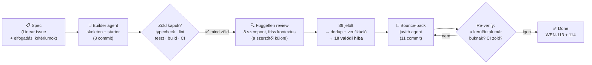
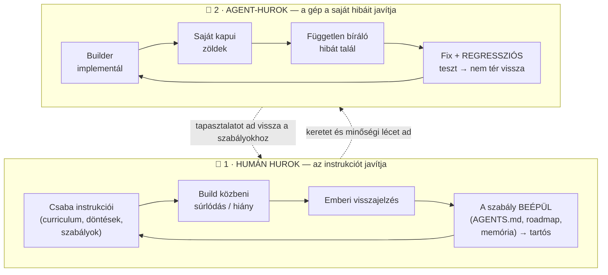
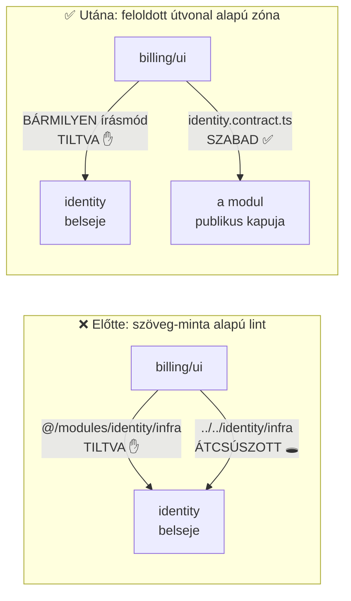

# Építési napló — Day 1 (2026.07.09)

*A nap terméke: a `reference-app/` váz + a `participant-starter/` — és az első teljes Repeat-Until-Good
kör. Szakszavak: [fogalomtár](../fogalomtar.md) · a teljes ív: [big picture](../big-picture.md)*

---

## 1. A nap egy képben

## 2. Szintézis — mit bizonyított a mai nap?

**A builder-agent minden zöld kapun átment — és a független bíráló mégis talált 10 valódi hibát.**
Köztük olyat is, ami egy publikus repóban titok-szivárgáshoz vezethetett volna. Ez a nap fő üzenete, és
egyben a workshop egyik központi tétele:

1. **A zöld pipeline nem jelent készet** — a gépi kapuk (typecheck, lint, teszt) csak azt fogják meg,
   amire megírták őket. A *friss kontextusú, független bíráló* azt is meglátja, amit a szerző (ember vagy
   agent) a saját kontextusában már nem képes.
2. **Mechanizmus > konvenció** — ami szabályként le van írva, az még nem érvényesül; ami linttel/hookkal
   ki van kényszerítve ÉS tesztelve van a megkerülhetetlensége, az igen.
3. **Két külön tanulási hurok működik** — és szét kell választani őket, mert máshol kell beavatkozni
   (lásd a következő szakasz).

## 3. A két tanulási hurok — szétválasztva

**Miért fontos a szétválasztás?** A két huroknak más a *terméke* és máshol kell javítani:

| | 🧑 Humán hurok | 🤖 Agent-hurok |
|---|---|---|
| **Mi váltja ki?** | Az emberi instrukció hiányos, kétértelmű, vagy a terv ütközik a valósággal | A gép a saját munkájában hibázik (minta-másolás, konfig, feltételezés) |
| **Ki fogja meg?** | Az ember (te), amikor átnézed az eredményt | A független bíráló-agent + a verifikáció |
| **Mi a javítás?** | A szabály/instrukció **tartósítása** (AGENTS.md, roadmap, memória) — hogy többé ne kelljen szóban kérni | Fix + **regressziós teszt** — hogy gépi garancia legyen rá |
| **Mit tanít?** | Hogyan kell agentnek jól instrukciót adni | Miért kötelező a szerző ≠ bíráló elv |

### 🧑 A mai humán-hurok tanulságok (a te instrukcióid nyomán)

1. **„A dokumentáció a builddel együtt készül"** — a Day 1 build lefutott napló nélkül; te jelezted a
   hiányt → mostantól **szabály** (roadmap + memória): minden build-nap naplóval + big-picture
   frissítéssel zárul. *Tanulság: ami csak szóbeli elvárás, az elveszik — ami szabályfájlban van, az érvényesül.*
2. **Instrukció-lánc torzulás (nyelvi politika):** a te D8-szabályod (AI-instrukció = angol) útközben, az
   én közvetítő promptomban felpuhult („HU komment OK") → a builder magyarul írta a DESIGN-GUIDELINE-t →
   a review megfogta mint szabálysértést. *Tanulság: a szabály a szabályfájlból érvényes, nem a
   továbbadott promptból — minél hosszabb a lánc, annál biztosabb, hogy torzul.*
3. **Terv-korrekció kimondva (monorepo → egy-app):** az architektúra-terv `/apps + /packages` monorepót
   írt; a builder — a taníthatósági elv alapján — egy-app `src/` layoutra tért el, és **jelezte** az
   eltérést. *Tanulság: az eltérés önmagában nem hiba — a NÉMA eltérés az; a „ha eltérsz, mondd ki"
   instrukció működött.*
4. **Pedagógiai követelmény → technikai döntés:** a te „az első 15 perc élménye a siker legyen" elvárásod
   közvetlenül formált kódot (lusta `getDb()`: az app adatbázis nélkül is zöld). *Tanulság: a jó humán
   instrukció nem technikai mikromenedzsment, hanem kimondott CÉL — a technikai leképezést az agent elvégzi.*

### 🤖 A mai agent-hurok tanulságok (a gép saját problémái — és miért jó, hogy így derültek ki)

**Miért jó ez nekünk?** Ezek a hibák NEM a te instrukcióidból jöttek — a gép termelte őket a saját
loopjában (minta-másolásból, konfig-feltételezésekből), és **a gépezet maga fogta meg őket**, mielőtt
embert értek volna. Pont ezt a védőhálót tanítjuk: nem az a cél, hogy az agent sose hibázzon (nem fog
sikerülni), hanem hogy a hibája **ne jusson el a felhasználóig**.

A legfontosabb eset (fent az ábrán): a modulhatár-lint **az import szövegét** nézte, nem azt, hogy a
feloldott útvonal hová mutat — így a relatív írásmód átcsúszott rajta. A javítás nem több minta lett,
hanem **erősebb mechanizmus** (feloldott-útvonal zónák) + **11 regressziós teszt**, ami a megtalált
kerülőutakat fixture-ként rögzíti. A többi eset (röviden — részletek lent az esettárban): nem gitignore-olt
titok-fájl; a doksi által ígért, de crashelő parancs; halott font-bekötés; sablon-defaultból örökölt
refetch-vihar; és a tanulságos csavar: **a bíráló is tévedett egyszer** (shadcn), és a javító agent
*verifikációval* cáfolta — nem vakon implementálta a review-t.

---

## 4. Esettár (részletek a szintézis mögé)

🧑 <b>H1 · Egy-app layout a monorepo helyett</b> — tudatos, jelzett terv-eltérés

**Probléma:** a terv `/apps + /packages` monorepót írt; 1 napos workshopon a workspace-konfiguráció
tanítási időt visz el. **Döntés:** egy Next.js-app `src/modules | platform | contracts` szerkezettel —
a terv struktúrája 1:1, egy deploy-egységben. **Elvetve:** pnpm/turborepo monorepo (nagy csapatnál jó út —
a notebookban „következő lépésként" szerepel majd). **Miért jó így:** a tanítandó elv a modulhatár, nem a
monorepo-tooling.

🧑 <b>H2 · Lusta <code>getDb()</code></b> — a pedagógiai cél formálta a kódot

**Probléma:** a nap elején nincs bekötött adatbázis; induláskori env-validálásnál az első élmény egy
hibaüzenet lenne. **Döntés:** a DB-kapcsolat csak az első tényleges hívásnál épül fel — a starter fork →
zöld build → élő preview út külső függés nélkül fut. **Elvetve:** fail-fast env-validálás (productionben
az a helyes — a notebook kimondja a trade-offot).

🤖 <b>A1 · Lyukas boundary-lint → feloldott-útvonal zónák + regressziós tesztek</b> (a nap fő esete)

**Mi történt:** a lint string-mintákkal tiltotta a cross-module deep importot (`@/modules/*/*`), de a
relatív írásmód (`../../identity/infra/schema`) és a domain-purity többszintű kerülőutai átcsúsztak —
a review élő eslint-futtatással bizonyította. **Javítás:** `import/no-restricted-paths` zónák (a szabály a
feloldott célt nézi, nem a szöveget; a zónák a létező modulmappákból generálódnak) + 11 teszt, ami a
kerülőutakat fixture-ként rögzíti. **Finomság:** stdin-tesztnél nem létező mappájú fájlnévvel a zóna nem
tüzel (ilyen fájl a valóságban nem létezhet) — **valódi fájllal kell tesztelni**. **Tanulság:** a
mechanizmus csak akkor ér valamit, ha a megkerülhetetlensége tesztelve van.

🤖 <b>A2 · Nem gitignore-olt <code>.mcp.json</code></b> — a legveszélyesebb fogás

**Mi történt:** a `.mcp.json.example` kommentje azt ígérte, hogy a másolat „gitignored", de egyik
.gitignore sem tartalmazta → egy API-kulcs a publikus repo historyjába kerülhetett volna. **Javítás:**
gitignore-bejegyzés root + app szinten (git check-ignore-ral igazolva). **Tanulság:** a hamis biztonsági
ígéret rosszabb, mint a hiányzó — a doksi-állítás is „kód", verifikálni kell.

🤖 <b>A3 · A doksi által ígért <code>db:generate</code> crashelt</b> — üres schema-glob

**Mi történt:** a drizzle schema-glob nulla fájlra illeszkedett, a drizzle-kit hibát dob üres globra —
miközben a README „csak DATABASE_URL kell" felkiáltással hirdette a parancsot. Ráadásul a config nyers
`process.env.DATABASE_URL!`-t használt a saját `env()` helperünk helyett (aminek addig 1 hívója volt — a
saját „one implementation ⇒ no interface" szabályunk ellen). **Javítás:** placeholder séma (a parancs
tiszta no-op) + a config az `env()`-et hívja → barátságos hibaüzenet ÉS a helper második hívója egyszerre.
**Tanulság:** a dokumentáció ígérete = spec; futtatva kell ellenőrizni.

🤖 <b>A4 · Sablonból örökölt hibák: font-önhivatkozás + QueryClient default</b>

**Mi történt:** (1) `--font-sans: var(--font-sans)` önhivatkozás mindkét appban — a Geist font letöltődött,
de sosem érvényesült; (2) a default `staleTime: 0` mellett minden ablak-fókusz újralövi az összes query-t —
25 laptopnál kérés-vihar lett volna a közös Neon ellen. **Javítás:** helyes var-lánc + `staleTime: 30_000`
kommenttel. **Tanulság:** az agent a sablont is „legközelebbi mintaként" másolja — a sablon hibáival együtt.

🤖 <b>A5 · CI copy-paste + az npm-lockfile lecke</b>

**Mi történt:** a két app CI-jobja byte-ra azonos copy-paste volt (drift-veszély), és a Windowson npm
11-gyel generált lockfile-t az ubuntu-s npm 10-es runner elutasította. **Javítás:** egyetlen matrix-job +
concurrency-cancel; lockfile `npx npm@10 install`-lal, mindkét npm alatt validálva. **Tanulság:** a
lockfile-t a CI npm-verziójával generáld; a CI-ben a duplikáció ugyanolyan drift-forrás, mint a kódban.

🤖 <b>A6 · „A bíráló is tévedhet" — a shadcn-eset</b>

**Mi történt:** a review az `shadcn` csomag törlését javasolta („csak CLI"). A javító agent **kipróbálta**
— és a build eltört: a `globals.css` importálja a `shadcn/tailwind.css`-t, tehát valódi runtime-függőség.
A javító dokumentálta az eltérést és megtartotta a csomagot. **Tanulság:** a review-visszajelzés sem
szentírás — *verifikálj, mielőtt implementálsz* (a lefuttatott bizonyíték a végső bíró).

---

## 5. Holnap (Day 2)

1. **Kapu (kézi lépések, Csaba):** Vercel-projekt + Neon-integráció + branch-per-preview —
   `reference-app/SETUP-STATUS.md` checklist.
2. **Risk-first (WEN-116):** Neon-branch-per-preview + Playwright-a-preview-n plumbing validálása —
   a workshop technikai csúcspontja.
3. Golden-path `tasks` slice (WEN-117) — és vele a Day 2 napló.
