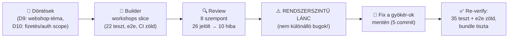
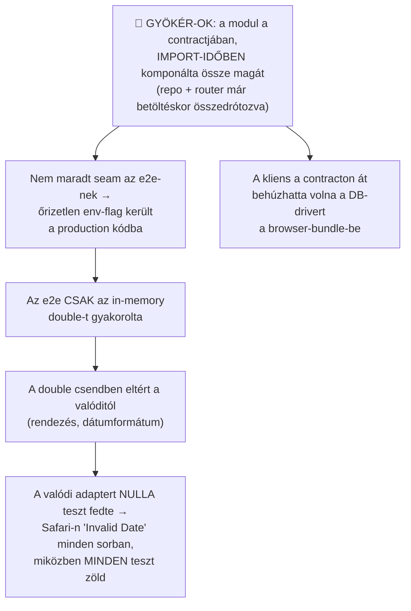

# Építési napló — Day 2 (2026.07.09–10): a workshops golden-path slice + a RUG-2 kör

*A nap terméke: az első valódi feature (workshops kurzus-CRUD) mint golden-path minta — és a második
Repeat-Until-Good kör, ami ezúttal egy **rendszerszintű hibaláncot** talált. Szakszavak:
[fogalomtár](../fogalomtar.md) · a teljes ív: [big picture](../big-picture.md) · előzmény: [Day 1](day-1.md)*

**Linear:** WEN-117 ✅ (D9-döntés: a referencia-app képzés-webshop lett; D10: fizetés PaymentPort + fake
adapter, auth = Neon Auth — ezek a Day 3 anyagai)

---

## 1. A nap egy képben

## 2. Szintézis — a nap két nagy tanulsága

### A) A hibák láncot alkotnak — a review akkor ér sokat, ha a láncot látja meg, nem a tüneteket

A 10 hiba nem tíz független apróság volt, hanem **egyetlen rossz szerkezeti döntés következmény-lánca**:

A javítás ezért nem tüneteket foltozott: a kompozíció átkerült a **composition rootba** (platform-szint),
az e2e-seam kemény guardot kapott (Vercelen beállítva az app **induláskor dob** — a komment nem guard),
a dátum-normalizálás az adapterbe került, és született egy **közös contract-tesztsuite**, ami mindkét
adaptert ugyanazzal a szerződéssel méri. *Egy mozdulat a gyökérnél = öt tünet eltűnik.*

### B) A teszt-double hűsége maga is szerződés

A „zöld teszt" csak annyit ér, amennyire a double hasonlít a valóságra. Nálunk a double másképp rendezett,
más dátumformátumot adott, és élő referenciákat szivárogtatott — a tesztpiramis egy **nem létező rendszert**
igazolt. A tanítható szabály: *ha egy portnak double-je van, kell egy közös tesztsuite, ami MINDKÉT
implementáción fut* — ez teszi becsületessé a portot.

## 3. A két tanulási hurok — szétválasztva

### 🧑 Humán hurok (az instrukciókat javítja)

1. **Instrukció-szivárgás, 2. eset:** a seed-adatba és a teszt-fixture-be a **valódi engagement számai**
   kerültek (ár, létszám, dátum együtt) — mert **az orchestráló prompt kérte így** („legyen egy
   realisztikus példa"). A builder hibátlanul követte a rossz instrukciót; a review fogta meg.
   *Tanulság: a „realisztikus példa" kérés publikus repóban veszélyes instrukció — a jó kérés:
   „életszerű, de kitalált".* (Day 1-en a nyelvi szabály torzult a láncban, ma az adat-hygiene — a minta
   ugyanaz: minél hosszabb az instrukció-lánc, annál több ponton torzulhat.)
2. **A spec kérte a felesleget:** a `getById` végpontot (amit semmi nem használt) az eredeti issue-spec
   írta elő — „CRUD"-reflexből. A YAGNI-elv most a spec-írót javította, nem a buildert.
   *Tanulság: a spec-be is beírandó, MIRE kell a végpont — ha nincs fogyasztója, nem kell.*
3. **Döntések aznap:** D9 (a referencia-app képzés-webshop — csak akkor éri meg, ha a Wenovának is
   hasznos) és D10 (fizetés = PaymentPort + fake adapter, Stripe utólagos adaptercsereként; auth = Neon
   Auth). *Tanulság: a „mi épüljön" döntés üzleti döntés — az emberé; a „hogyan" a folyamaté.*

### 🤖 Agent-hurok (a gép saját hibái — és a háló, ami megfogta)

A lánc minden eleme (2.A szakasz) gépi eredetű volt, és **embert sosem ért el**: a friss kontextusú
bírálók találták meg, a javító pedig a gyökérnél javította. Két külön kiemelés:

- **A bíráló árnyaltan ítélt a portról:** a `WorkshopRepo` interfész maradhatott (a perzisztencia
  tényleg variálódó határ), de az indoklása — „két valódi implementáció", a teszt-double-t számolva —
  **kiüresítette volna a szabályt** („kell egy interfész? írj egy double-t!"). A javítás a szöveg lett,
  nem a kód: az indoklás cseréje + explicit mondat, hogy *a double sosem számít második implementációnak*.
- **A javító megint mert eltérni:** a specifikált guard (`NODE_ENV==='production'`-re is dobjon) megölte
  volna magát az e2e-t (a `next start` production-módban fut) — a javító ezt észrevette, Vercel-only
  guardot épített, és **dokumentálta az eltérést**. Ugyanaz a minta, mint a Day 1-es shadcn-eset:
  *verifikálj, mielőtt implementálsz — a review-instrukció sem szentírás.*

## 4. Esettár (részletek, összecsukva)

🤖 <b>A1 · Import-idejű kompozíció → composition root + kemény guard</b> (gyökér-ok)

**Előtte:** `workshops.contract.ts` modul-szinten hívta a `createWorkshopsRouter(createWorkshopRepo())`-t
— az adapter-választás betöltéskor bebetonozódott, ezért kellett env-flag az infrában, és a contract
value-importja a Neon-drivert is magával húzta volna. **Utána:** a contract csak **factory-kat** exportál;
a kompozíció a `root.ts`-ben történik; az `E2E_IN_MEMORY_DB` seam ott él, regressziós teszttel fedett
guarddal (Vercelen → startup throw). A kliens-bundle grep-igazoltan driver-mentes.

🤖 <b>A2 · Dátum-hűség: normalizálás az adapterben</b> (a Safari-bug helyes mélységű javítása)

A Postgres `2026-07-14 09:00:00+00` formátumot a Safari `new Date()`-je Invalid Date-nek parsolja — és
ezt semmilyen teszt nem fogta, mert az e2e az ISO-t adó in-memory úton futott. **Javítás:** közös
`toIsoTimestamp()` mindkét adapterben (a domain-típus újra szigorú ISO), unit-teszttel. A UI-t nem kellett
bántani — a hibát ott javítottuk, ahol keletkezett.

🤖 <b>A3 · Közös port-contract tesztsuite</b> (a double becsületesítése)

Egy describe-factory, ami ugyanazt a szerződést (rendezés kevert időzónákkal, snapshot-szemantika,
szigorú ISO) **mindkét** adapteren futtatja: in-memory mindig, Drizzle feltételesen (`TEST_DATABASE_URL`
— a Neon-bekötés után élesedik; jelenleg 6 teszt skip, dokumentáltan). Plusz: a double javítva
(kronologikus rendezés, defenzív másolatok).

🧑 <b>H1 · Seed/fixture anonimizálás</b> (az instrukció-szivárgás javítása)

Minden minta-adat „Sample Workshop", kerekített kamu-ár, generikus kapacitás és 2027-es dátumok —
grep-igazoltan nincs valós szám a repóban. A tanítási érték változatlan, a szivárgás megszűnt.

🤖 <b>A4 · Lint-kerítés a scripts/ és e2e/ mappákra + a seed legitim útja</b>

A boundary-zónák csak `src/**`-re vonatkoztak — a seed-script deep-importtal nyúlt a modul belsejébe,
miközben a doksi „lint-enforced"-öt hirdetett (ugyanaz a hibaosztály, mint a Day 1-es lint-lyuk: az
állítás és a mechanizmus szétvált). **Javítás:** a kerítés kiterjesztve (+5 regressziós fixture), a
seed-logika a modulba került és a contracton át exportálódik (`seedDemoWorkshops`), a runner a platform
`env()`+`getDb()`-jét használja — a kézi .env-parser törölve (`tsx --env-file-if-exists`).

🤖 <b>A5 · UI-hibakezelés + korlátos lista + e2e-takarítás + DX</b>

Delete-hibák megjelennek (eddig némán elnyelődtek); stale mutation-error nem ragad be újranyitott
űrlapba; a lista `.limit(50)`-es („a korlátlan SELECT lassított lefolyású üzemzavar"); az e2e a létrehozott
sort törli is (nem szemeteli a közös preview-DB-t, ÉS a delete-út is e2e-fedett lett);
`reuseExistingServer: !CI` (nem kell percekig buildelni minden lokális e2e-hez, nincs port-ütközés a
dev-szerverrel).

🤖 <b>A6 · Cleanup: YAGNI a golden pathban</b>

`getById` törölve (nulla fogyasztó — az ADR jegyzi: visszajön, ha lesz detail-nézet); contract-exportok
a ténylegesen fogyasztott készletre vágva („every export is a promise"); `idInput` a
`workshopSchema.pick()`-ből származtatva; `notFound()` helper a triplázott hibakonstrukció helyett;
közös `formatDate`/`formatHuf` a `lib/format.ts`-ben.

---

## 5. Holnap (Day 3)

1. **⚠️ KAPU — továbbra is nyitva:** a Vercel + Neon kézi bekötés (`reference-app/SETUP-STATUS.md`).
   Ez már a kritikus út: nélküle nincs WEN-116 plumbing (PR→preview+DB-branch+e2e), nem fut a Drizzle
   contract-teszt-ág, és nincs élő URL. **4 nap van a workshopig.**
2. WEN-116 plumbing-validálás (a kattintások után azonnal).
3. WEN-141: Neon Auth + registrations + pricing + checkout (PaymentPort + fake adapter).
4. WEN-118: az orchestrátor/RUG toolkit-anyaggá desztillálása — a két lefutott RUG-kör a nyersanyag.
