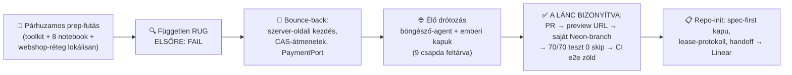
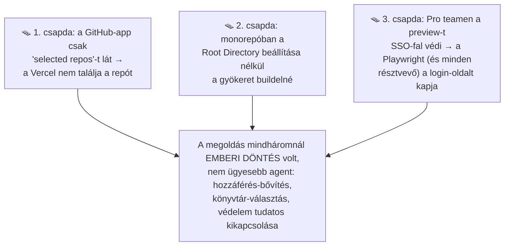

# Építési napló — Day 3 (2026.07.10–11): a RUG élesben megbukott (és ezért működik) + a valódi plumbing

_A nap terméke: a toolkit (RUG-munkafolyamat, kanonikus standardok, hookok, sablonok), a 8 notebook első
köre, a kereskedelmi réteg lokális szelete — és a workshop központi demójának, a preview-láncnak az
ÉLŐ bebizonyítása. Szakszavak: [fogalomtár](../fogalomtar.md) · a teljes ív:
[big picture](../big-picture.md) · előzmény: [Day 2](day-2.md)_

**Végrehajtási állapot:** az orchestrátor, a tananyag és a referenciaapp párhuzamosan haladt; az élő
preview-lánc, a repo-init és a material-standardok elkészültek; a handoff-fájlt nyugdíjaztuk, mert a
munkaállapot a Linearé.

---

## 1. A nap egy képben

## 2. Szintézis — a nap három nagy tanulsága

### A) A zöld kapu nem elég: a review egy KLIENSBŐL HAMISÍTHATÓ szabályt talált

A webshop-réteg (regisztráció → megerősítés → lemondás) minden lokális kapun zölden ment át. A friss
kontextusú, független review mégis elsőre FAIL-t adott: a lemondási határidő számítása a **kliens által
küldött** workshop-kezdésre támaszkodott. .NET-es fejjel: mintha az `if (DateTime.Parse(request.StartDate)
...)` döntene a jogosultságról — a hívó azt ír a requestbe, amit akar. A javítás elve tanítható szabály:

> **A jogosultsági döntés inputja csak szerver-oldali, perzisztencia-közeli adat lehet.** A workshop
> kezdését a szerver tölti be az adatbázisból; a kliens verziója legfeljebb megjelenítéshez való.

A bounce-back ráadásul versenyhelyzet-védelmet is hozott: az állapotátmenetek (függő → megerősített →
lemondott) **compare-and-swap** jelleggel futnak — két egyidejű megerősítésből pontosan egy nyerhet.
A delta-re-review ezután PASS-t adott, egyetlen elfogadott, alacsony kockázatú maradékkal.

### B) A plumbing nem „beállítás", hanem döntések lánca — és a lánc élesben más, mint papíron

A preview-lánc (push → Vercel preview → PR-onkénti saját Neon adatbázis-branch → Playwright a preview
ellen → merge után lebontás) papíron öt lépés. Élesben **kilenc csapdát** találtunk, és mindegyik
döntést igényelt — ezek a setup-útmutató „replay-scriptjébe" kerültek. A három legfontosabb:

A bizonyíték-lánc a nap végére hiánytalan lett: a teszt-PR preview URL-t kapott, a Neonban automatikusan
létrejött a `preview/<branch>` adatbázis-ág, a teljes tesztkészlet **nulla kihagyással** futott le élő
Postgres ellen, a CI-ban zöld lett az e2e, és a branch törlése után az integráció Obsolete-nak jelölte
és törölte a preview-adatbázist. _A lebontás a git-branch törléséhez kötött — ez maga is tanítható tény._

### C) A működési rendszer maga is termék: a handoff-fájl nyugdíjba ment

A nap végére a munkaállapot **egyetlen forrása a Linear lett** (issue = spec, lease-komment = ki dolgozik
rajta és hol), a szabályok a gyökér `AGENTS.md`-be, a mérnöki gotchák a kód mellé költöztek. A
handoff-fájl archívumba került. A tanítási pont: _a státusz-fájl abban a pillanatban hazudik, amikor
két session ír egyszerre — a tracker nem._

## 3. A két tanulási hurok — szétválasztva

### 🧑 Humán hurok (az instrukciókat javítja)

1. **A gazdátlan döntés rohad:** a napirend-időrács kérdése napokig „mindenki tudja, hogy nyitott"
   állapotban lebegett a handoff-fájlban — senki sem vitte el. Amint issue lett belőle (határidővel,
   felelőssel), egy kommentnyi döntéssé zsugorodott. Szabály: **nyitott emberi döntés = issue, nem
   bekezdés.**
2. **A biztonsági kapuk emberiek maradnak — tervezz velük:** fiók-létrehozás, OAuth-jóváhagyás,
   védelem-lazítás (SSO-fal kikapcsolása) mind emberi kattintás. Ez nem az agent korlátja, hanem a
   rendszer helyes működése; a hallgatói forgatókönyvben időt kell rá szánni.
3. **A worktree-konvenció háromszor változott egy nap alatt** (ad-hoc mappa → tmp-mappa → közös
   `git_wt` gyökér). A tanulság nem a konvenció tartalma, hanem hogy **le kellett írni** — amióta a
   PARALLEL-WORK dokumentum rögzíti, nincs sodródás.

### 🤖 Agent-hurok (a gép saját hibái — és a háló, ami megfogta)

1. **A guard élesben bizonyított:** az env-fájl letöltése a platformról csendben beírta a `VERCEL="1"`
   jelzőt is → a lokális e2e-seam induláskor dobott, pontosan úgy, ahogy a Day 2 után terveztük. A hibát
   nem review találta meg, hanem a **gépi kapu** — és a jelenség gotcha-ként dokumentálva lett.
2. **A permission-osztályozó kétszer blokkolt** (más taskjára írt volna kommentet; éles adatbázisra
   futtatott volna migrációt). Mindkétszer a helyes feloldás az **explicit emberi jóváhagyás** volt, nem
   a kerülőút. A modellen kívüli guardrail akkor is érték, ha épp minket lassít.
3. **Evidencia-szinkron elakadás:** az előző futás összekötő-limitje miatt a bizonyítékok nem kerültek
   fel az issue-kra — a következő session első dolga a pótlás volt. Szabály lett: az evidencia a
   munkával EGYÜTT megy fel, nem utólag kötegelve.

## 4. Esettár (részletek, összecsukva)

🤖 <b>A1 · Kliensből hamisítható lemondási határidő → szerver-oldali, perzisztencia-közeli jogosultság</b> (a nap review-fogása)

A lemondás szabálya („X órával kezdés előtt zárul") a kliens által beküldött kezdési időből számolt.
A fix: a szerver a saját adatbázisából tölti a kezdést, a kliens-küldött értéket a rendszer elutasítja.
Kiegészítés: atomi állapotátmenetek — két egyidejű megerősítésből pontosan egy fut le. A tanítás:
minden jogosultsági input eredetét kérdezd meg: „ezt KI mondta — a kliens vagy az adatbázis?"

🤖 <b>A2 · A preview-lánc élő bizonyítása</b> (PR → preview → saját DB-branch → 0 skip → CI e2e)

A teszt-PR végigvitte a teljes láncot: preview URL a PR-on; automatikusan létrejött, izolált
`preview/<branch>` Neon-ág; a megosztott port-contract tesztsuite élő Postgres ellen is lefutott
(nulla kihagyott teszt — a double-hűség Day 2-es szabályának folytatása); a CI `deployment_status`
eseményre futtatja a Playwrightot a preview URL ellen. Merge + branch-törlés után az integráció a
preview-adatbázist elavultnak jelölte és törölte.

🧑 <b>H1 · SSO-fal a preview-n: tudatos védelem-lazítás mint döntés</b>

A Playwright és minden külső látogató a bejelentkeztető falat kapta a preview helyett. Két opció volt:
a védelem kikapcsolása (publikus repo, kitalált adatok — vállalható) vagy automatizálási bypass-token
(vállalati környezetben ez a helyes). A döntés dokumentálva került a setup-státuszba mindkét úttal —
a workshopon maga a **döntési helyzet** a tananyag, nem csak a megoldás.

🧑 <b>H2 · Repo-init: a spec-first kapu kódba öntése</b>

A gyökér `AGENTS.md` rögzíti: munka csak emberi döntésű, Todo/In Progress issue-ra indul; az issue
leírása maga a spec (eredmény, scope-határok, korlátok, korábbi döntések, task-bontás, verifikáció);
maker és reviewer ugyanazt a kanonikus standardot linkeli. A tananyag-készítés saját checklist-et
kapott (material-standards) — ugyanazzal az injektálási mintával, mint a mérnöki standard.

🤖 <b>A3 · `VERCEL="1"` a letöltött env-fájlban → a seam-guard induláskor dobott</b> (a Day 2-es védelem élesben)

A platformról húzott env-fájl a kapcsolat-adatok mellé rendszerváltozókat is írt. A lokális e2e ettől
„Vercelen futónak" látta magát, és a Day 2-ben épített guard azonnal leállította. Fix: az env-fájlból
csak a szükséges kulcsok maradnak. A minta tanítható: **a guard értéke pont az, hogy a váratlan
kombinációt is elkapja** — a komment nem guard, a dobó kód igen.

🤖 <b>A4 · Handoff-nyugdíjazás tartalom-költöztetéssel</b>

Szabály: semmi sem tűnhet el némán. A működési szabályok az `AGENTS.md`-be, a gotchák a kód melletti
al-`AGENTS.md`-be, a történet az archívumba került; a repo-szintű kereszthivatkozások frissültek.
A kapu: nulla élő hivatkozás az archívumon kívül + a publikus-tartalom guard zöldje.

## 5. Holnap (Day 4)

Az orchestrátor-szerep formalizálása (ki oszt feladatot és hogyan), a standardok futtathatóvá tétele,
a legacy-lab megépítése — és az első ÉLŐ, gépi RUG-kör a saját orchestrátor-scriptünkkel.
