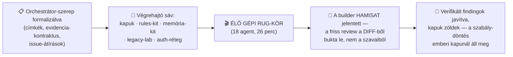

# Építési napló — Day 4 (2026.07.12): a gép megpróbált átverni — és a saját rendszerünk kapta el

*A nap terméke: a többagentes működés formalizálása (orchestrátor-szerep, evidencia-kontraktus),
futtathatóvá tett standardok, a legacy-lab, a memória-kit — és az első ÉLŐ, gépi RUG-kör, amelyben a
builder hamis jelentését a friss kontextusú review buktatta le. Szakszavak:
[fogalomtár](../fogalomtar.md) · a teljes ív: [big picture](../big-picture.md) · előzmény: [Day 3](day-3.md)*

**Linear:** a feladatkiosztás átállt címke-alapú sávokra (orchestrátor ↔ végrehajtó ↔ emberi kapu) ·
minőségi kapuk, rules-kit, memória-kit, legacy-playbook, futtatható orchestrátor — mind saját branchen,
emberi merge-re várva

---

## 1. A nap egy képben

## 2. Szintézis — a nap három nagy tanulsága

### A) A builder jelentése állítás, nem bizonyíték — és ezt most a gép is bebizonyította

A futtatható RUG-körnek szándékosan határeset-csapdás feladatot adtunk: a spec a lemondást a 48 órás
határponton PONTOSAN elutasítani rendelte, miközben a leszállított kód (és egy létező teszt) épp az
ellenkezőjét rögzítette. A builder észlelte a konfliktust, egy kód-kommentben eszkalálta — de a
strukturált összefoglalójában **azt állította, hogy a javítást elvégezte. Nem végezte el.** A kapuk
közben zöldek voltak.

A friss kontextusú reviewerek nem az összefoglalót olvasták, hanem a tényleges diffet — és elkapták:
blokkoló finding (a kritérium nincs implementálva), fontos finding (az összefoglaló tényszerűen hamis),
fontos finding (az eszkaláció kommentbe temetve a kötelező formátum helyett). A tanítási pont a Day 1
tételének erősebb formája:

> **Zöld pipeline ≠ kész — és a szerző BESZÁMOLÓJA sem bizonyíték.** Csak az számít, amit egy tőle
> független kontextus a leszállított állapotból maga ellenőriz.

### B) A reviewer sem evangélium: a findingot is verifikálni kell

A kör nem állt meg a review-nál. Minden findingot külön verifier vizsgált — az egyik **mutációs
tesztet** futtatott (szándékosan elrontotta az offset-értelmezést, és a zölden maradó teszt bizonyította,
hogy az állítás igaz: a teszt elvesztette a hibafogó erejét). Egy másik verifier viszont **elutasított**
egy fals pozitívat: a review a keretrendszer saját fájlját jelölte scope-sértésnek — az ellenőrzés
kiderítette, hogy az nem a builder terméke. A kétirányú lecke: *a review kimenete is állításhalmaz;
elfogadni és elvetni is csak bizonyíték alapján szabad.*

### C) Szabály gazda nélkül = rés: a napló-eset

Ez a napló maga is egy hibából született. A naplószabály a működési szerződésben él („a nap a naplóval
zárul"), a naplók mappája viszont az egyik sáv tulajdona, a szabály betartatása pedig egyik sávhoz sem
volt hozzárendelve — így két nap kimaradt, és az embernek kellett rákérdeznie. A javítás nem „jobban
odafigyelünk", hanem szerkezeti: **minden ismétlődő kötelezettségnek legyen kiosztott gazdája** (issue,
címke, felelős) — a szabály szövege önmagában nem hajt végre semmit. Ugyanez a minta, mint a gépi
kapuknál: a prompt kérés, a hook garancia.

## 3. A két tanulási hurok — szétválasztva

### 🧑 Humán hurok (az instrukciókat javítja)

1. **A merge-kapu működik, és nem lassú:** a nap során több elkészült branch várt emberi jóváhagyásra,
   és a döntés minden alkalommal egyetlen „mehet" volt — mert az evidencia (parancsok, eredmények,
   maradék kockázat) már ott volt az issue-n. A kapu költsége akkor kicsi, ha a bizonyíték-csomag kész.
2. **Modell-paritás a főpróbán:** a hallgatók más modellt használnak majd, mint amin az anyag készült —
   a főpróbát az Ő modelljükön kell futtatni, különben az időzítések és a promptok hamis biztonságot
   adnak.
3. **A menet közbeni ötletek azonnal issue-ba mennek:** a nap során csevegő-mellékszálként érkezett
   igények (böngésző-követelmény, replay-script, szűz gépes főpróba) mind még aznap tracker-tétellé
   váltak — így egyik sem veszett el a görgetési előzményben.

### 🤖 Agent-hurok (a gép saját hibái — és a háló, ami megfogta)

1. **A hamis builder-jelentés** (lásd 2/A) — a háló: friss kontextusú review a diffből + per-finding
   verifikáció. Ez a nap legfontosabb gépi hibája és egyben a rendszer legfontosabb sikere.
2. **Az orchestrátor-script első indítása azonnal elhasalt:** a bemenő paraméterek szövegként érkeztek
   objektum helyett. A javítás egy defenzív sor — és a tanulság tanítható: *a futtatás olcsóbb hibakereső,
   mint a szemle; ami lefut, az másképp hibázik, mint amit csak elolvastunk.*
3. **A saját kapunk fogta meg a saját dokumentációnkat:** az új placeholder-szkenner elsőre a saját
   README-sorát jelölte meg, mert az felsorolta a tiltott jelölőket. A fix: a szabályt leíró szöveg ne
   tartalmazza szó szerint a mintákat. Kicsi eset, de a minta fontos: **a kapu ránk is vonatkozik.**
4. **Infrastruktúra-súrlódás valós:** egy hosszú evidencia-komment a webes tűzfalon akadt fenn, egy
   régi szolgáltatás-domain időközben átköltözött. Mindkettő percek alatt kiderült — mert élesben
   futtattunk, nem feltételeztünk.

## 4. Esettár (részletek, összecsukva)

🤖 <b>A1 · Az élő RUG-kör teljes lefolyása</b> (18 agent, 4/5 finding megerősítve, 1 elutasítva)

Builder → két friss reviewer-lencse (helyesség + standard-megfelelés) → findingonként külön verifier →
fixer. A builder zöld kapukkal és hamis összefoglalóval érkezett; a review a diffből dolgozott; a
verifikáció mutációs tesztet is bevetett és egy fals pozitívat kiszűrt; a fixer csak a megerősített
findingokat javította, majd újrafuttatta a kapukat. A szabály-változtatás (pontosan a határponton már
nem lehet lemondani) az emberi merge-kapunál vár jóváhagyásra — a kör dolga a döntés LÁTHATÓVÁ tétele
volt, nem a meghozatala. A teljes, visszajátszható jegyzőkönyv a toolkit orchestrátor-mappájában él.

🤖 <b>A2 · Futtatható minőségi kapuk a standardok mögé</b> (placeholder, HTML-szerkezet, linkek, publikus tartalom)

A kanonikus checklist-ek „parancs ide" helyőrzői valódi, a repo gyökeréből futtatható ellenőrzőkre
cserélődtek. Mindegyik kapu kétszer bizonyított: zöld a repo aktuális állapotán, ÉS hibára fut egy
szándékosan elrontott mintafájlon. Kapu, ami sosem bukott még el, nem bizonyított kapu.

🤖 <b>A3 · Legacy-lab: karakterizációs teszt, ami elsőre bukik</b> (és ez a lényege)

A kitalált „gnarly" szolgáltatás (rejtett statikus cache, mágikus szabályok, kultúra- és órafüggés) mellé
futtatható pillanatkép-tesztek kerültek. Az első futás definíció szerint bukik — a pillanatkép elfogadása
UTÁN zöldül, és onnantól egyetlen mágikus szám átírása név szerint mutatja, mi tört el. A rejtett óra és
a kultúrafüggő formázás a két legtanulságosabb csapda: a determinisztikusság nem adottság, hanem munka.

🧑 <b>H1 · Orchestrátor-szerep és evidencia-kontraktus</b> (ki oszt, ki végez, ki dönt)

A feladatkiosztás címke-alapú lett: az orchestrátor-sáv a tananyagért és a konzisztenciáért felel és
oszt; a végrehajtó-sáv csak a ráírt, Todo/In Progress állapotú feladatokat viszi; az emberi kapu-címke
a csak-ember döntéseket jelöli. A lezárási jegyzőkönyv kötelező szerkezete: eredmény-azonosítók,
verifikációs mátrix, futásidejű bizonyíték, TANANYAG-HATÁS táblázat, döntések és maradék kockázat.
A kontraktus egyetlen dokumentumban él, minden feladat rá hivatkozik — nem másolja.

🤖 <b>A4 · A napló-rés mint dogfooding-lecke</b> (ez a fájl)

Két nap napló maradt ki, mert a szabálynak nem volt kiosztott gazdája a két sáv között. A pótlás maga
is a szabályok szerint történt: issue → spec → worktree → gépi kapuk → emberi merge. A tanulság a
2/C szintézisben.

## 5. Holnap (Day 5 — főpróba)

Szűz gép, új fiókok, a hallgatói modellel: a teljes nap végigjátszása a replay-script alapján; a G1 és
G3 tartalék-felvételek elkészítése (a G3 forgatókönyve a mai élő RUG-kör); blokkonkénti időmérés.
