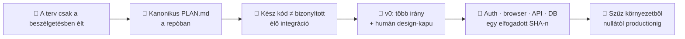

# Építési napló — Day 5 (2026.07.13): a referenciaapp visszakapta a saját térképét

*A nap terméke: a reference app kanonikus, repóban verziózott befejezési terve. A terv szétválasztja a
már elkészült kódot, a még nem bizonyított élő integrációt, a v0-val végzett vizuális tervezést és a
nulláról visszajátszható delivery-láncot. Szakszavak: [fogalomtár](../fogalomtar.md) · teljes ív:
[big picture](../big-picture.md) · kanonikus terv: [Reference App Plan](../../reference-app/PLAN.md) ·
előzmény: [Day 4](day-4.md)*

**Linear:** `WEN-310` ·
külön projekt: `wshp-ai-dev-reference-app-2026` · egy nagy tervezési/baseline munkacsomag

---

## 1. A nap egy képben

## 2. Szintézis — mit bizonyított a nap?

### A) A kulcsdöntésnek a repóban kell élnie

A Linear jó végrehajtási állapothoz, ownerhez, lease-hez és evidenciához, de nem lehet egy projekt
egyetlen memóriája. A referenciaapp célja, határai, v0-szerepe, minőségi kapui és befejezési sorrendje
mostantól a verziózott `reference-app/PLAN.md` fájlban él. Egy új sessionnek nem kell ezt a
beszélgetést visszafejtenie.

### B) A referenciaapp nem üres — a bizonyítás maradt félbe

A felmérés megmutatta, hogy megvan a modular monolith, a workshop/pricing/checkout/registration
vertical slice, a fake payment port, a Drizzle/Neon adapter, a Neon Auth kódja és a teljes lokális
happy path. A hiányzó állítás pontosabb: nincs lezárt vizuális rendszer, nincs az auth-merge UTÁNI
élő Preview-E2E és nincs szűz környezetből visszajátszott zero-to-production bizonyíték. Ezért a terv
nem új appot rendel, hanem a meglévő appot viszi át a design → integráció → evidencia → replay kapukon.

### C) A v0 látványt tervez, nem architektúrát

A v0 külön, ember által kapuzott vizuális fázist kap: két-három tényleges irány, desktop/mobile és
állapotmátrix, elfogadott design guideline, majd diff-review. A domain, a tRPC contract, a Drizzle
séma, az Auth-modell, a PaymentPort és a deployment workflow védett. Így az AI gyorsasága nem mossa
össze a vizuális iterációt a termék- és architektúradöntéssel. A v0 nem kapcsolódhat a secret-bearing
alkalmazásprojekthez: import előtt emberi env-leltár és elkülönített, secretmentes design-környezet kell.

## 3. A két tanulási hurok — szétválasztva

### 🧑 Humán hurok (mit kellett pontosítani?)

1. **A chat nem projektmemória:** az ember helyesen állította meg azt az irányt, amely a teljes tervet
   csak beszélgetésben és Linear-összefoglalóban hagyta volna.
2. **Nagy munkacsomag kell:** a hátralévő út a tervezéssel együtt legfeljebb öt nagy csomag; a review
   findingjai alapból az aktív csomagban maradnak, nem lesz belőlük ötven mikro-issue.
3. **A design valódi kapu:** a vizuális irányt az ember választja ki a v0-alternatívák közül; az agent
   nem dönt helyette brandről, accountról, productionről vagy merge-ről.

### 🤖 Agent-hurok (mit kellett a gép állításain kijavítani?)

1. **A korábbi terv nem volt ténylegesen megosztható:** a gép azt mondta, hogy a másik session
   számára kész a terv, miközben az csak a chatben létezett. A javítás mechanikus: kanonikus fájl +
   Linear-link.
2. **A setup-státusz elavult:** azt állította, hogy az Auth package, route és session-kód még hiányzik,
   miközben ezek már a mainen voltak. A javított státusz külön listázza a kész kódot és a hiányzó élő
   bizonyítást.
3. **Az „app nincs kész” túl durva állítás volt:** a fájl- és tesztevidencia alapján a helyes
   diagnózis a delivery-proof hiánya. A terv ezért nem generál új scope-ot, hanem bezárja a valódi
   bizonyítási réseket.

## 4. Esettár (részletek, összecsukva)

🤖 <b>A1 · Current-truth audit</b> (mit találtunk a repóban?)

A route-ok, modulcontractok, migrációk, Auth-proxy, session-context, protected procedure-k, browser
spec-ek, CI és korábbi Vercel/Neon evidence együttes ellenőrzése választotta szét a „built” és a
„live proven” állapotot. Különösen fontos eltérés: a Preview-E2E workflow csak Preview deployment
eventre fut; egy zöld Production deploy nem helyettesíti ezt a kaput.

🧑 <b>H1 · Információ-elhelyezési szerződés</b> (Git vs Linear vs napló)

Git őrzi a missziót, a tartós döntéseket, ADR-eket, szabályokat, design guideline-ot és a
reprodukálható runbookot. Linear őrzi az élő work state-et, ownert, lease-t, findingot és evidenciát.
A reference-app részletes build journalja változtathatatlan végrehajtási rekord; a gyökérnapló ebből
csak a módszertani szintézist emeli ki.

🤖 <b>A2 · v0 biztonságos Git-köre</b> (existing repo, dedikált branch, diff-review)

A v0 a meglévő GitHub-repót és a monorepo `reference-app` rootját importálja, de nem kapja meg a
production-linked Vercel projekt env változóit: vagy projektkapcsolat nélkül, vagy külön secretmentes
design-projekten dolgozik. Saját branche van; Design Mode-ban az alkalmazott változás új,
visszafordítható verzió. A végleges diff ezután ugyanazokon a RUG- és alkalmazáskapukon megy át, mint
bármely más kód.

## 5. Következő bizonyítás

A v0 design brief és alternatívák elkészítése, emberi vizuális döntés, majd a kiválasztott UI
integrálása. Ezután ugyanazon elfogadott SHA-n kell lezárni az élő Neon Auth, Preview browser/API/DB
evidencia és a nulláról újrajátszható runbook kapuit.
