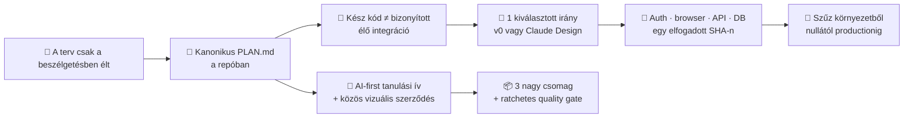

# Építési napló — Day 5 (2026.07.13): a termék és a tananyag visszakapta a saját térképét

_A nap terméke: a reference app kanonikus, repóban verziózott befejezési terve és a résztvevői
tananyag AI-first, vizuális helyreállítási terve. Az első szétválasztja a kész kódot a még nem
bizonyított élő integrációtól; a második három nagy munkacsomagba rendezi az egynapos tanulási ív,
az eszközkészlet és a közös vizuális rendszer javítását. Szakszavak: [fogalomtár](../fogalomtar.md) · teljes ív:
[big picture](../big-picture.md) · kanonikus terv: [Reference App Plan](../../reference-app/PLAN.md) ·
előzmény: [Day 4](day-4.md)_

**Végrehajtási állapot:** Linear · a tartós döntések és szabályok a repóban · nagy, integrálható munkacsomagok

---

## 1. A nap egy képben

## 2. Szintézis — mit bizonyított a nap?

### A) A kulcsdöntésnek a repóban kell élnie

A Linear jó végrehajtási állapothoz, ownerhez, lease-hez és evidenciához, de nem lehet egy projekt
egyetlen memóriája. A referenciaapp célja, határai, v0-szerepe, minőségi kapui és befejezési sorrendje
mostantól a verziózott `reference-app/PLAN.md` fájlban él. Egy új sessionnek nem kell ezt a
beszélgetést visszafejtenie.

### B) A referenciaapp nem üres — a bizonyítás maradt félbe

A felmérés megmutatta, hogy megvan a modular monolith, a workshop/pricing/checkout/registration
vertical slice, a fake payment port, a Drizzle/Neon adapter, a Neon Auth kódja és a teljes lokális
happy path. A hiányzó állítás pontosabb: nincs lezárt vizuális rendszer, nincs az auth-merge UTÁNI
élő Preview-E2E és nincs szűz környezetből visszajátszott zero-to-production bizonyíték. Ezért a terv
nem új appot rendel, hanem a meglévő appot viszi át a design → integráció → evidencia → replay kapukon.

### C) A v0 látványt tervez, nem architektúrát

A vizuális tervezés külön, ember által kapuzott fázist kap: egy előre kiválasztott irány,
desktop/mobile és állapotmátrix, elfogadott design guideline, majd diff-review. Az ingyenes v0-keret
csak egy teljes irányra használható; ha nem elérhető vagy elfogy, ugyanaz a brief egyetlen verzióra
a Claude Designhoz kerül. A domain, a tRPC contract, a Drizzle
séma, az Auth-modell, a PaymentPort és a deployment workflow védett. Így az AI gyorsasága nem mossa
össze a vizuális iterációt a termék- és architektúradöntéssel. A v0 nem kapcsolódhat a secret-bearing
alkalmazásprojekthez: import előtt emberi env-leltár és elkülönített, secretmentes design-környezet kell.

### D) A tananyag formája is a módszert tanítja

A résztvevő a minimális bootstrap után nem pontos parancsokat másol: természetes nyelven megbízza
Claude Code-ot vagy Codexet, az agent végrehajt, bizonyítékot hoz, az ember pedig kapuz és javíttat.
Ugyanez a szerződés vezeti végig a teljes napot. A közös vizuális szerepek — ember, agent, gépi kapu,
artifact, evidence és kockázat — ezért nem díszítő CSS-elemek, hanem a módszer látható nyelve.

## 3. A két tanulási hurok — szétválasztva

### 🧑 Humán hurok (mit kellett pontosítani?)

1. **A chat nem projektmemória:** az ember helyesen állította meg azt az irányt, amely a teljes tervet
   csak beszélgetésben és Linear-összefoglalóban hagyta volna.
2. **Nagy munkacsomag kell:** a hátralévő út a tervezéssel együtt legfeljebb öt nagy csomag; a review
   findingjai alapból az aktív csomagban maradnak, nem lesz belőlük ötven mikro-issue.
3. **A design valódi kapu:** az ember még generálás előtt kiválasztja az egyetlen kidolgozandó
   vizuális irányt; az agent nem költi el a keretet alternatívákra, és nem dönt helyette brandről,
   accountról, productionről vagy merge-ről.
4. **A minimális bootstrap kivétel tudatos döntés:** utána a résztvevő nem parancsokat tanul, hanem
   megtanulja specifikálni, ellenőrizni és javíttatni az agent munkáját.

### 🤖 Agent-hurok (mit kellett a gép állításain kijavítani?)

1. **A korábbi terv nem volt ténylegesen megosztható:** a gép azt mondta, hogy a másik session
   számára kész a terv, miközben az csak a chatben létezett. A javítás mechanikus: kanonikus fájl +
   Linear-link.
2. **A setup-státusz elavult:** azt állította, hogy az Auth package, route és session-kód még hiányzik,
   miközben ezek már a mainen voltak. A javított státusz külön listázza a kész kódot és a hiányzó élő
   bizonyítást.
3. **Az „app nincs kész” túl durva állítás volt:** a fájl- és tesztevidencia alapján a helyes
   diagnózis a delivery-proof hiánya. A terv ezért nem generál új scope-ot, hanem bezárja a valódi
   bizonyítási réseket.
4. **A vizuális konvenció önmagában nem guard rail:** közös stílus, hozzáférhető link-szerződés,
   sötét kódfelület és regressziós teszt együtt akadályozza meg, hogy az új oldalak visszacsússzanak.

## 4. Esettár (részletek, összecsukva)

🤖 <b>A1 · Current-truth audit</b> (mit találtunk a repóban?)

A route-ok, modulcontractok, migrációk, Auth-proxy, session-context, protected procedure-k, browser
spec-ek, CI és korábbi Vercel/Neon evidence együttes ellenőrzése választotta szét a „built” és a
„live proven” állapotot. Különösen fontos eltérés: a Preview-E2E workflow csak Preview deployment
eventre fut; egy zöld Production deploy nem helyettesíti ezt a kaput.

🧑 <b>H1 · Információ-elhelyezési szerződés</b> (Git vs Linear vs napló)

Git őrzi a missziót, a tartós döntéseket, ADR-eket, szabályokat, design guideline-ot és a
reprodukálható runbookot. Linear őrzi az élő work state-et, ownert, lease-t, findingot és evidenciát.
A reference-app részletes build journalja változtathatatlan végrehajtási rekord; a gyökérnapló ebből
csak a módszertani szintézist emeli ki.

🤖 <b>A2 · v0 biztonságos Git-köre</b> (existing repo, dedikált branch, diff-review)

A v0 a meglévő GitHub-repót és a monorepo `reference-app` rootját importálja, de nem kapja meg a
production-linked Vercel projekt env változóit: vagy projektkapcsolat nélkül, vagy külön secretmentes
design-projekten dolgozik. Saját branche van; Design Mode-ban az alkalmazott változás új,
visszafordítható verzió. A végleges diff ezután ugyanazokon a RUG- és alkalmazáskapukon megy át, mint
bármely más kód.

🤖 <b>A3 · AI-first tananyag-alap</b> (szerződés, stílus, ratchet)

A kanonikus helyreállítási terv rögzíti a minimális bootstrap kivételt, az egész nap aktív agentet,
az ember–agent–evidence–RUG mikrociklust és a szolgáltatói tartalékutat. A közös CSS szemantikus
szerepeket és egyetlen olvasható, sötét blokk-kódfelületet ad. A render- és diagramellenőrzők az új
hibákat azonnal megállítják, miközben a három nagy csomag fokozatosan felszámolja a név szerint ismert
régi eltéréseket.

🤖 <b>A4 · A vizuális szerződés használat közben</b> (szerepek, valódi linkek, AI-társ)

A koordinátor tulajdonában álló tizenkét résztvevői útvonal ugyanazt a szemantikus nyelvet kapta:
emberi döntés, agentmunka, gépi kapu, munkadarab, bizonyíték és kockázat. A meglévő hasznos ábrákat
nem rajzoltuk újra csak az újdonság kedvéért; a régi monokróm csomópontokat szerep szerint színeztük,
és csak a valódi tananyag- vagy naplóútvonalat jelölő elemek lettek billentyűzettel is elérhető linkek.
Minden ilyen célpont az ábra melletti HTML-változatban is elérhető.

Az oldalak önmagukban is bemutatják a munkaszerződést: mit kér a résztvevő természetes nyelven, mit
végez a Claude Code vagy a Codex, mely döntés marad az embernél, milyen bizonyíték enged tovább, és
hol kell a RUG-kört újraindítani. A napló egyik örökölt feladata még pontos futtatási parancs
megfogalmazását kérte a résztvevőtől; ezt agent által végzett mechanizmusválasztásra és
pozitív–negatív bizonyításra cseréltük.

A fogalomtár áttekintő ábrájánál a teljes sluglista másolata helyett dinamikus „minden kanonikus
fogalom” szerződés lett a manifestben. Így a diagramelvárás mindig a checkoutban lévő fogalomtárból
származik: az ellenőrzés 57 és 70 fogalmas registryvel is átment, egy szándékosan hiányos registryt
pedig megállított. Ez bizonyítja, hogy a kapu a szerződést védi, nem egy tegnapi elemszámot.

🤖 <b>A5 · A friss review visszapattintotta a látszólag kész vizuális migrációt</b> (szerep, fókusz, olvashatóság)

A független ellenőrző három olyan eltérést talált, amelyet a zöld build önmagában nem mutatott meg.
A huszonegy kattintható SVG-csomópont alakja még nem használta mindenhol a közös szemantikus
`node-shape` horgot, ezért a hover és a billentyűzetfókusz nem adott látható visszajelzést. Az AI-társ
„Mit végez az agent?” kártyái tévesen determinisztikus gépi szerepet kaptak. Több ábra magyarázó
szövege pedig 12–13 képpontos maradt, ami a tényleges renderelt méretben túl apró volt.

A javítás nemcsak színt cserélt: a linkelt alakok szerepet kaptak, az agentkártyák az agent
szemantikába kerültek, a magyarázó feliratokat 15–16 képpontra emeltük és a hosszú sorokat több
sorra tördeltük. Két negatív fixture azóta külön bizonyítja, hogy szemantikus hover/fókusz-horog
nélküli SVG-link, illetve gépi szerepű agentkártya nem mehet át. A tanulság: a „kattintható” és az
„olvasható” nem forráskód-tulajdonság; valós böngészőben kell bizonyítani.

## 5. Következő bizonyítás

A referenciaappnál a kiválasztott vizuális irány emberi ACCEPT után integrálva; a következő
bizonyítás ugyanazon elfogadott SHA-n az élő Neon Auth, a Preview browser/API/DB evidencia és a
nulláról újrajátszható runbook lezárása. A tananyagnál az AI-first vizuális alap korai integrációját
követte a koordinátori oldalak szemantikus migrációja. Erre épülhet párhuzamosan a C0–C7 tanulási
ív, valamint az eszköz–fogalomtár–starter csomag. A három csomag elfogadott merge-e után egyetlen
összeállított main-ellenőrzés bizonyítja majd a teljes link-, diagram-, publikus tartalom- és
böngészőmátrixot; addig egyik részcsomag eredménye sem helyettesíti a végső integrációs bizonyítékot.
