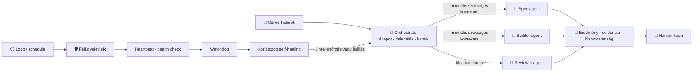

# Építési napló — Day 6 (2026.07.14): a koordináció és az autonómia felügyeleti rendszert kapott

_A nap terméke: az orchestration és a tartós autonómia közös, forrásokkal alátámasztott
tanítási modellje a Markdown-forrásban, a résztvevői HTML-ben és a D3 prezentációban.
Kapcsolódó fogalmak: [fogalomtár](../fogalomtar.md) · teljes fejezet:
[Orchestration és autonómia](../orchestration-es-autonomia.md) · előzmény: [Day 5](day-5.md)_

**Végrehajtási állapot:** egy Linear issue · egy branch · egy összefüggő tananyagcsomag · emberi merge-kapu

---

## 1. A nap egy képben

## 2. Szintézis — mit bizonyított a nap?

### A) Az orchestration elsődlegesen kontextus- és döntésmenedzsment

Az orchestrator nem attól értékes, hogy sok agentet indít. Ő tartja egyben a célt, az állapotot,
a függőségeket, a lease-eket és a minőségi kapukat. A worker csak a feladatához szükséges minimális
csomagot kapja; cserébe eredményt, evidenciát és bizonytalanságot ad vissza. A zajos megvalósítási
részletek így nem szorítják ki a koordinációhoz szükséges döntéseket.

### B) Nincs bizonyított univerzális „150–200 utasításos” plafon

A kutatás a sok, összetett vagy egymásnak ellentmondó korlátozás melletti megbízhatóságromlást
alátámasztja, de egy minden modellre érvényes darabszámot nem. Ezért a tananyag **instrukciós
keretet** tanít: rövid, prioritásos szabályok; kontextusizoláció; gépi guard railek; evalokkal mért
betartás. A pontosnak hangzó, de nem igazolt szám helyett mérhető működési szerződés került a helyére.

### C) A loop felébreszt, a felügyelet tartja életben

A goal megmondja, mi a kész; a loop vagy schedule újraindítja a munkát; a hook eseményre reagál.
Ezek még nem alkotnak 24/7 rendszert. Ehhez heartbeat, health check, watchdog, idempotens újrapróbálás,
backoff, naplózás és emberhez eszkaláló hibakeret kell. A **self-healing** itt nem végtelen retry:
észlelés → osztályozás → engedélyezett, korlátozott helyreállítás → újraellenőrzés → siker vagy stop.

### D) A workshop csak biztonságos szeletet demonstrál

A Linear-autopilot játékban az orchestrator egy Todo feladatot vesz fel, ellenőrzi a specifikációt,
majd specifikáció-review vagy implementáció felé viszi. Tesztet és PR-t készíthet, de a specifikáció
elfogadása és a merge emberi kapu marad. Éles automatikus merge vagy deploy nincs a gyakorlatban.

## 3. A két tanulási hurok — szétválasztva

### 🧑 Humán hurok

1. **A hiányzó elméletet az ember nevezte meg:** orchestration és tartós autonómia nélkül a módszertan
   csak egyedi agentműveleteket mutatott.
2. **A kemény állítás bizonyítást igényelt:** a „150–200” számot nem fogadtuk el pusztán azért, mert
   hihetőnek hangzott.
3. **Az autonómia határa emberi döntés:** specifikáció-elfogadás, merge és production-jogosultság nem
   kerül automatikusan az agenthez.

### 🤖 Agent-hurok

1. **Forráskeresés → claim guard:** a primer források alapján az agent az általános plafon helyett
   tesztelhető instrukciós keretet fogalmazott meg.
2. **Egy modell → három felület:** ugyanaz a fogalmi szerződés került a Markdownba, a HTML-be és a
   Gamma-forrásba; nem három egymástól elsodródó magyarázat készült.
3. **Trigger → supervisor:** az agent különválasztotta az ütemezést a felügyelettől, és minden
   automatikus helyreállítást korláttal, újraellenőrzéssel és stop-feltétellel kötött össze.

## 4. Esettár

🤖 <b>A1 · Kontextus-szerződés</b> [orchestration] [context]

A worker csomagja: elvárt eredmény, scope, szükséges input, kanonikus standard, bizonyítási kritérium
és visszatérési szerződés. A teljes beszélgetés, minden korábbi log és más workerek részletei csak akkor
kerülnek bele, ha tényleges függőséget jelentenek. A reviewer friss kontextusa tudatos hibakeresési
eszköz, nem információvesztés.

🤖 <b>A2 · Korlátozott self-healing</b> [autonomy] [operations]

Egy eltűnt worker újraindítható, egy lejárt lease visszavehető, egy átmeneti hálózati hiba backoffal
újrapróbálható. Ismeretlen hiba, kimerült retry-budget, sérült adat vagy jogosultsági bizonytalanság
esetén a helyes „gyógyulás” a biztonságos leállás és az ember értesítése. Minden kísérlet auditálható
állapotváltásként kerül a naplóba.

🧑 <b>H1 · Linear-autopilot szerepjáték</b> [workshop] [human-gate]

Az oktató vagy egy résztvevő állapotkártyákkal játssza el a Linear-folyamatot: Todo → specifikáció →
emberi review → Todo → implementáció és tesztek → PR → emberi merge. A csoport minden átmenetnél
megnevezi a szükséges evidenciát, a timeoutot, az idempotenciát és a stop-feltételt. Ha az élő
integráció bizonytalan, ugyanez a gyakorlat API-hívás nélkül is teljes értékű.

## 5. Következő bizonyítás

A teljes tananyagkapu, a valós böngészős desktop/mobile ellenőrzés és a friss kontextusú review együtt
bizonyítja, hogy a két új fogalom nemcsak bekerült, hanem ugyanazzal a jelentéssel, olvashatóan és
gyakorolhatóan jelenik meg minden rétegben. A Gamma csak egy új D3-verziót kap; a régi változatot csak
visszaolvasott tartalmi ellenőrzés után váltja le.
