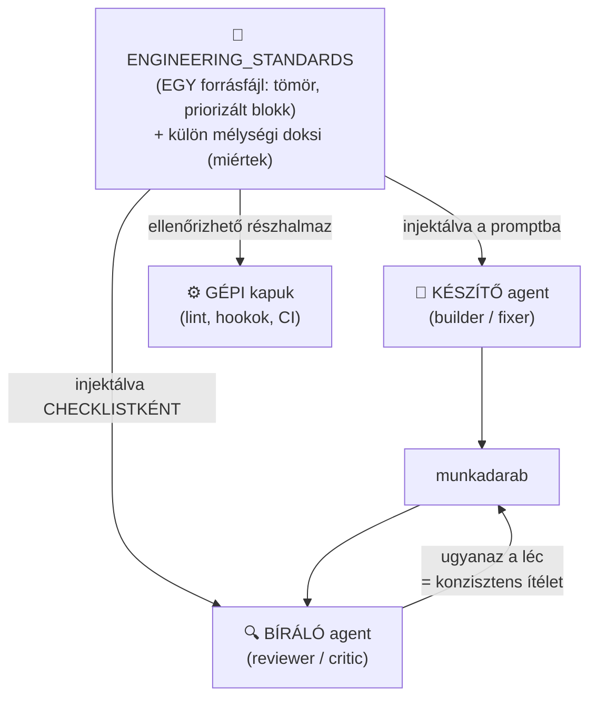

# Mérnöki standardok — egy forrásból, a készítőbe ÉS a bírálóba injektálva

*Wenova AI-Assisted Development Workshop — 2026.07 · tananyag a G4 modulhoz ·
a minta ennek a repónak a nyilvánosan ellenőrizhető építési folyamatából jön*

> Szakszavak: [fogalomtár](fogalomtar.md) · kapcsolódó: [pluginek és skillek](plugins-es-skillek.md)

---

## 🧠 Döntés-doboz: hová kerüljön a szakmai alapléc?

**Az alapprobléma (ellenőrizhető repópélda).** Ha a szakmai code-craft alapléc —
DRY, KISS, YAGNI, SOLID, clean code, elnevezések, clean-architecture függőségi irány, SRP — **nincs a
rendszer állandó működési szerződésében**, akkor a folyamat-doksik csak a governance-t fedik, a készítő-agent
promptja csak annyit mondott, „kövesd a cél-repo AGENTS.md-jét", a bíráló pedig projekt-specifikus volt.
Az eredmény: **az embernek feladatonként újra el kellett magyaráznia az alapokat** — és ami ennél rosszabb:
a készítő és a bíráló pedig **más-más léc szerint** dolgozhat, így a review nem azt kéri számon, amire a maker
épített. Ennek a repónak a megoldása a lent hivatkozott, közös standard.

**A választásunk.** Egy **kanonikus standard-blokk**, egyetlen forrásfájlban — és ez a blokk
**hivatkozással injektálódik minden készítő- ÉS minden bíráló-promptba** (a bírálóéba explicit
checklistként).

**Miért így?**
1. **Egy forrás = nincs drift.** Egy helyen szerkeszted, mindenhol érvényes — a maker, a reviewer és a
   gépi ellenőrzések (lint/fitness) ugyanazt a lécet látják.
2. **A bíráló csak akkor kéri számon, amit lát.** A friss kontextusú reviewer nem tudja, mi a házirend,
   ha nem kapja meg — a checklist-formában injektált standard teszi a review-t következetessé.
3. **Tömör a promptban, mély a doksiban.** A ~200-instrukciós plafon (lásd fogalomtár) miatt a promptba
   csak a priorizált, tömör blokk kerül; a teljes indoklás külön dokumentumban él (progressive
   disclosure).
4. **Ami gépileg ellenőrizhető, azt gép ellenőrizze.** A standard ellenőrizhető részhalmaza NEM a
   modellre bízva, hanem lintben/hookban is kikényszerítve — a prompt kérés, a mechanizmus garancia.

**Alternatívák (elvetve):**
- *„Benne van az AGENTS.md-ben, elég."* — Az AGENTS.md-t a **készítő** olvassa a repóban; a friss
  kontextusú **bíráló** subagent promptja külön él — ha oda nem injektálod, a bíráló a saját ízlése
  szerint ítél. (Pontosan ezt éltük meg.)
- *Feladatonként beírni a promptba kézzel.* — Ez a „feladatonként újra elmagyarázom" állapot, ami elől
  menekülünk; és a kézi másolatok azonnal driftelnek.
- *Mindent gépi szabályba (lint) tenni.* — A léc nagy része (naming-minőség, SRP-ítélet, YAGNI) nem
  automatizálható; a lint a részhalmazt fedi, a többihez modell-instrukció kell.

## A minta egy képben

## Mit tartalmazzon a standard-blokk? (a minimál-készlet)

| Pillér | Egy mondatban |
|---|---|
| **DRY** | Ne ismételd — de ne is absztrahálj két használat előtt (a duplikáció olcsóbb, mint a rossz absztrakció) |
| **KISS / YAGNI** | A legegyszerűbb működő forma; semmit „későbbre" — funkció akkor épül, ha van fogyasztója |
| **SOLID, pragmatikusan** | Interfész csak ott, ahol a határ tényleg variálódik; egy implementáció ⇒ nincs interfész |
| **Clean code + elnevezés** | A kód a dokumentáció: kimondó nevek, kis függvények, nincs halott kód |
| **SRP / separation of concerns** | Egy modul egy okból változzon; a rétegek felelőssége nem keveredik |
| **Függőségi irány** | Befelé mutat (domain nem tud a külvilágról) — nálunk ezt lint is őrzi |
| **Definition of Done** | Mikor „kész": zöld kapuk + teszt + doksi + a bíráló jóváhagyása |
| **Eszkalációs formátum** | Ha az agent dönteni nem tud: strukturált „DECISION REQUIRED" visszaadás az embernek |

## Hogyan képződik le ebben a repóban?

- **Készítő oldal:** a repo `AGENTS.md`-je előírja a kanonikus
  [`material-standards.md`](../toolkit/standards/material-standards.md) vagy
  [`engineering-standards.md`](../toolkit/standards/engineering-standards.md) hivatkozását; az agent a
  feladathoz illő teljes standardot olvassa, nem másolatot kap.
- **Bíráló oldal:** a review-agentek/subagentek prompt-sablonja **ugyanarra a forrásra hivatkozik**, és a
  bíráló a teljes standardot explicit checklistként használja — a workshop toolkit-orchestrátora így épül
  (a bíráló nem „általában véleményez", hanem a lécet pipálja végig).
- **Gépi részhalmaz:** boundary-lint (feloldott útvonalak + regressziós tesztek), typecheck, tesztek —
  ami ellenőrizhető, az nem a modell jóindulatán múlik.

## Hol él a munka állapota?

A [Linear-issue](fogalomtar.md#linear-work-state) leírása a spec; az aktív lease-komment nevezi meg a branch-et,
worktree-t és scope-ot; a trace-komment rögzíti a commit SHA-t, parancsokat, review-t és maradó kockázatot.
**Külön handoff-fájlt nem készítünk.** Így a következő agent ugyanabból az élő koordinációs állapotból indul,
miközben a Git-commit változatlan, auditálható eredmény marad.

> **Vidd haza:** a szakmai léc nem "tudás, amit az agent majd magától alkalmaz", hanem **működési
> szerződés, amit minden szerepbe injektálsz** — egy forrásból, hogy a készítő, a bíráló és a gép
> ugyanazt a mércét lássa.
