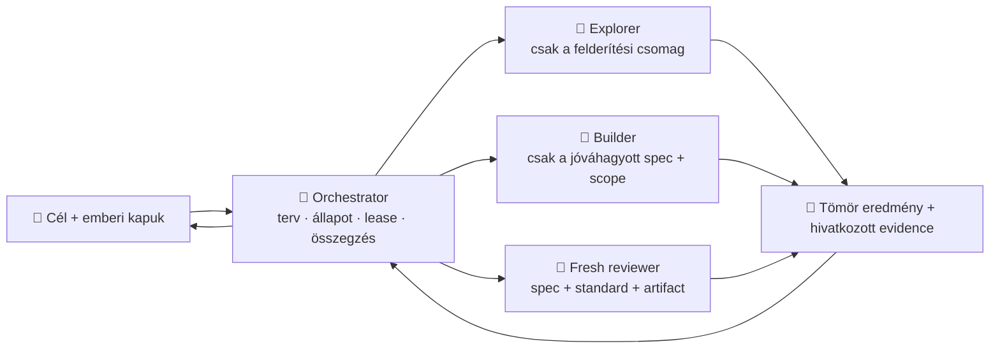
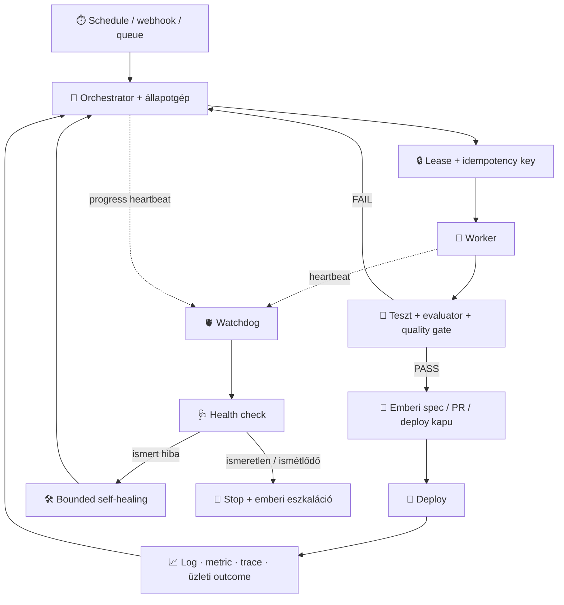

# Orchestration és megbízható autonóm működés — oktatói háttér

> Ez a fejezet a workshop két hiányzó elméleti elemét köti össze. Az
> [orchestration](fogalomtar.md#orchestration-pattern) a munka és a kontextus
> koordinációs mintája; a tartós autonómia pedig üzemeltetési rendszer, nem egy
> végtelen prompt. A résztvevői változat a
> [módszertan oldalon](modszertan/index.html) olvasható.

## 1. Orchestration: a koordinátor nem mindentudó főagent

Az [orchestrator](fogalomtar.md#orchestrator) feladata a cél, az állapot, a
függőségek, a munkahatárok és a kapuk kezelése. A megvalósítás részleteit
elkülönített [subagentekre](fogalomtar.md#subagent) bízza, majd ellenőrizhető,
tömör eredményeket gyűjt vissza. Ettől az orchestration nem egyszerűen
„több agent párhuzamosan”, hanem **kontextus- és döntésmenedzsment**.

Az orchestrator kontextusában marad:

- a cél, az elfogadási feltételek és a tiltott scope;
- a munkafolyamat állapota, a függőségek, a lease és a döntési napló;
- a subagentek rövid eredménye, bizonyítékhivatkozása és bizonytalansága;
- a következő emberi vagy gépi kapu.

Nem marad ott alapértelmezetten:

- teljes buildlog, stack trace vagy keresési jegyzet;
- az összes beolvasott fájl és a készítő teljes gondolatmenete;
- másik munkadarabhoz tartozó szabály vagy beszélgetés;
- a reviewer számára torzító készítői önértékelés.

### A minimum elégséges subagent-csomag

Egy delegált feladat csomagja hat mezőből áll:

1. **Eredmény:** mi készüljön el?
2. **Határ:** mi tartozik bele és mi marad érintetlen?
3. **Bemenet:** mely artifactokat vagy fájlokat vizsgálja?
4. **Kanonikus szabály:** melyik repószabályt és standardot kell alkalmaznia?
5. **Bizonyítás:** milyen ellenőrzés és evidencia igazolja a kész állapotot?
6. **Visszaadási szerződés:** rövid összegzés, hivatkozott evidence, kockázat és
   bizonytalanság — nyers napló csak kérésre.

Ez nem a subagent „butítása”. A releváns információ jel–zaj arányát növeli, és
az orchestrator koordinációs kontextusát is tisztán tartja.

## 2. Nincs univerzális „150–200 instrukciós” plafon

A workshop korábbi szövege túl pontos tapasztalati szabályt mondott ki. Nem
találtunk olyan elsődleges kutatást, amely minden frontier modellre és minden
feladatra érvényes, 150–200 magas szintű instrukciós kemény határt igazolna.
Az igazolt, tanítható állítás ennél hasznosabb:

> **A hosszabb kontextus nem azonos a megbízhatóan felhasznált kontextussal. A
> több, összetettebb, egymással versengő vagy irreleváns instrukció növeli a
> kihagyás és a konfliktus kockázatát.**

A „Lost in the Middle” vizsgálat szerint a modellek a hosszú kontextus közepén
lévő releváns információt gyakran rosszabbul használják. Ebből azonban nem
vezethető le egyetlen, termékfüggetlen instrukció-darabszám. Ezért
**instrukciókerettel** dolgozunk:
kevés, prioritásos, nem ismétlődő szabály; feladatspecifikus kontextus; gépileg
kikényszerített kritikus korlát; és saját reprezentatív eval.

## 3. A loop és a schedule csak ébresztőmechanizmus

Claude Code-ban a `/goal`, `/loop` és az ütemezett feladatok, Codexben a Goal és
a Scheduled feladatok képesek folytatni vagy időzítve újraindítani munkát. Ezek
hasznos belépési pontok, de önmagukban nem alkotnak megbízható, éjjel-nappal
működő rendszert.

| Mechanizmus | Mire jó? | Mit nem garantál? |
|---|---|---|
| Goal / completion condition | A következő iterációt a mérhető végállapot felé indítja. | Nem bizonyítja a cél helyességét és nem helyettesíti a független review-t. |
| Loop | Nyitott munkamenetben ismétel vagy pollol. | Nem feltétlenül él túl session-, gép- vagy hálózati hibát. |
| Schedule / routine | Idő vagy esemény alapján új futást indít. | A sikeres indulás nem jelenti a feladat sikerét; nem felügyeli önmagát. |
| Hook | Életciklus-eseménynél determinisztikus ellenőrzést indít. | Nem teljes üzemeltetési és recovery rendszer. |

Tartós működéshez a modellhívás köré **supervision plane** kell:

### Heartbeat, watchdog és health check

- A [heartbeat](fogalomtar.md#heartbeat) egy időbélyegzett jel: a komponens él,
  és megnevezi az aktuális futást, állapotot, checkpointot és utolsó előrelépést.
- A [watchdog](fogalomtar.md#watchdog) az agenttől független felügyelő. A hiányzó
  vagy elavult heartbeatből nem rögtön „restartot”, hanem diagnózist indít.
- A [health check](fogalomtar.md#health-check) több kérdést választ szét:
  **liveness** — fut-e; **readiness** — biztonságosan fogadhat-e munkát;
  **progress** — halad-e; **dependency health** — eléri-e a Lineart, GitHubot,
  modellt, adatbázist; **quality health** — működik-e az evaluator és a gate.

A process „él” lehet úgy is, hogy húsz perce ugyanazt az issue-t olvassa. Ezért a
heartbeat mellett progress-deadline, lease-lejárat és checkpoint is kell.

## 4. Mit jelent a self-healing?

A [self-healing](fogalomtar.md#self-healing) **nem** azt jelenti, hogy az agent
korlátlanul átírhatja saját szabályait vagy végtelenül újrapróbálkozik. A helyes
definíció:

> Ismert hibát észlelő, előre korlátozott helyreállítási playbook, amely a
> biztonságos állapotot visszaállítja, az eredményt újraellenőrzi, és ismeretlen
> vagy ismétlődő hiba esetén megáll és embert riaszt.

Tipikus bounded recovery:

1. hibás worker leállítása és lease-ének lejáratása;
2. visszatérés az utolsó tartós checkpointra;
3. idempotens újrafuttatás exponenciális backoffal és jitterrel;
4. hibás függőség leválasztása vagy circuit breaker nyitása;
5. nem feldolgozható feladat karanténba/dead-letter sorba helyezése;
6. recovery utáni readiness-, adatkonzisztencia- és quality-check;
7. retry-budget kimerülésekor kill switch, riasztás és emberi döntés.

Minden mellékhatásos lépéshez deduplikáció vagy idempotency key kell, különben
egy watchdog két PR-t, két tranzakciót vagy két deployt hozhat létre.

## 5. Mit naplózunk és mit figyelünk?

A három alapjel — **log, metric, trace** — ugyanazokat a korrelációs azonosítókat
kapja: `run_id`, `issue_id`, `attempt_id`, `agent_id`, `model`, `tool`,
`prompt/rule/skill version`, `commit_sha`, `deployment_id`. Titkot, teljes
promptot vagy személyes adatot alapból nem naplózunk; tartalmi mintát csak
redaktálva és szükséges megőrzési idővel.

| Réteg | Kötelezően figyelt jel |
|---|---|
| Állapotgép | állapotváltás, queue age, lease tulajdonos/lejárat, checkpoint, elakadás ideje |
| Agent és eszköz | indítás/befejezés, tool call időtartam és exit, timeout, retry, token/költség, modell- és konfigurációverzió |
| Minőség | elfogadási feltétel, teszt/eval eredmény, finding, fals pozitív, emberi felülbírálás, rollback |
| Függőségek | API-hiba, rate limit, auth, hálózat, DB-kapcsolat, query latency, lock és connection-pool |
| Infrastruktúra | CPU, memória, disk, process, queue depth, hálózat; trend és küszöb együtt |
| Termék | hibaarány, válaszidő, sikeres feladat, használat, üzleti outcome és guardrail-metrika |

Egy zöld scheduler-run csak azt bizonyítja, hogy a futás elindult és technikailag
kilépett. A feladat sikerét külön completion condition, evaluator, quality gate
és szükség szerint emberi kapu bizonyítja.

## 6. Workshop-kísérlet: „Linear autopilot”, biztonságos homokozóban

**Cél:** megfigyelni az állapotgépet és a kontextuscsomagokat, nem production
autonómiát építeni.

### Válassz egy futási módot — a kettő nem keverhető

1. **DRY_RUN / READ_ONLY:** sem Linear-, Git-, repo- vagy PR-írás nem
   engedélyezett. Az agent csak a javasolt állapotátmeneteket, specet,
   worktree/implementációs tervet, teszttervet és trace-t adja vissza.
2. **TRAINER_SANDBOX:** kizárólag az oktató által név szerint allowlistelt Linear
   projektben és gyakorló repóban írhat. Egyszerre egy issue; kötelező lease;
   60 másodperces poll; legfeljebb 15 perc futás; hibánként legfeljebb 2 retry;
   legfeljebb 2 USD becsült modellköltség; emberi kill switch. Automatikus merge
   és production deploy ebben a módban is tilos.

### A résztvevő természetes nyelvű megbízása

> **TRAINER_SANDBOX módban** figyeld a név szerint allowlistelt Linear projekt
> Todo állapotát. Egyszerre legfeljebb egy
> feladatot vegyél lease alá. Először csak értékeld, hogy a spec végrehajtható-e.
> Ha hiányos, készíts specifikációs javaslatot, tedd emberi review-ra, majd állj
> meg. Ha az ember jóváhagyta és visszatette Todo-ba, külön worktree-ben
> implementálj; írj és futtass teszteket; friss kontextusú review után készíts
> PR-javaslatot, majd állj meg. Merge-et és production deployt ne végezz.
> Minden állapotváltáshoz adj evidence-et, a limit vagy bizonytalanság elérésekor
> engedd el a lease-t és kérj emberi döntést.

**DRY_RUN / READ_ONLY változat:** ugyanazt az állapotgépet értékeld, de ne írj a
Linearba, Gitbe, repóba vagy PR-ba. Minden mutáció helyett add vissza a tervezett
átmenetet, az elkészítendő artifactot és a bizonyítékot egy szimulált trace-ben.

### Állapotgép

1. `Todo + nincs jóváhagyott spec` → spec-javaslat → `Human spec review` → stop.
2. `Todo + jóváhagyott spec` → lease → worktree → implementáció + teszt + RUG.
3. Minden kapu zöld → PR → `Human PR review` → stop.
4. Emberi merge után → deploy-evidence megfigyelése; éles módosítás nélkül.
5. Production telemetria → trend/finding-javaslat → ember által priorizált új issue.

**Kész:** a résztvevő egy futás trace-éből meg tudja mutatni az állapotváltásokat,
a subagent-csomagokat, a két emberi stopot és legalább egy recovery-döntést.

**Tipikus hibák:** duplikált issue-felvétel, lejárt lease, elakadt worker, hamis
zöld evaluator, rate limit, nem idempotens retry, túl tág jogosultság és
korlátlan pollolás.

**Plan B:** előre rögzített trace és kártyás szerepjáték. Egy résztvevő a
scheduler, egy az orchestrator, egy a worker, egy a watchdog, egy az emberi
kapu; a csoport hiba-kártyákat húz, majd eldönti: retry, rollback, quarantine
vagy stop + eszkaláció.

## Elsődleges és hivatalos források

- [Anthropic — Building effective agents](https://www.anthropic.com/engineering/building-effective-agents)
- [Anthropic — Effective context engineering for AI agents](https://www.anthropic.com/engineering/effective-context-engineering-for-ai-agents)
- [Anthropic — Effective harnesses for long-running agents](https://www.anthropic.com/engineering/effective-harnesses-for-long-running-agents)
- [Claude Code — scheduled tasks és `/loop`](https://code.claude.com/docs/en/scheduled-tasks)
- [Claude Code — Goal](https://code.claude.com/docs/en/goal)
- [OpenAI — Codex subagent workflows](https://learn.chatgpt.com/docs/agent-configuration/subagents)
- [OpenAI — Scheduled tasks](https://learn.chatgpt.com/docs/automations)
- [OpenAI — Long-running work](https://learn.chatgpt.com/docs/long-running-work)
- [Liu et al. — Lost in the Middle](https://arxiv.org/abs/2307.03172)
- [Kubernetes — liveness, readiness és startup probes](https://kubernetes.io/docs/concepts/workloads/pods/pod-lifecycle/#container-probes)
- [Kubernetes — Self-healing](https://kubernetes.io/docs/concepts/architecture/self-healing/)
- [OpenTelemetry — log, metric és trace korreláció](https://opentelemetry.io/docs/specs/otel/logs/)
- [AWS — timeouts, retries and backoff with jitter](https://aws.amazon.com/builders-library/timeouts-retries-and-backoff-with-jitter/)
