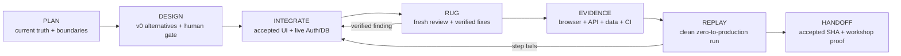

# Reference App 2026 — canonical completion plan

**Status:** approved project plan

**Planning baseline:** human-approved on 2026-07-13

**Linear project:** `wshp-ai-dev-reference-app-2026`

**Canonical engineering standard:** [`../toolkit/standards/engineering-standards.md`](../toolkit/standards/engineering-standards.md)

**Workshop big picture:** [`../materials/big-picture.md`](../materials/big-picture.md)

This file is the durable source of truth for **what the reference application is,
why it exists, how it will be completed, and what evidence makes it done**. Linear
tracks current work state, ownership, leases, acceptance evidence, and execution
history. Key product, architecture, visual-design, and delivery decisions must not
exist only in Linear or in a chat transcript.

## 1. Big picture

The primary workshop product is an agent-ready development operating system. The
reference app is its representative validation workload: a small training webshop
that is complex enough to prove the method from specification to production without
becoming a product-development programme of its own.

The app must do three jobs at once:

1. **Working software:** a participant can discover an invented workshop, calculate
   its price, authorize a fake payment, register, confirm, and cancel.
2. **Worked example:** every meaningful change demonstrates the workshop method —
   scoped instructions, a versioned spec, quality gates, a fresh-context RUG review,
   browser/API/data evidence, and a human merge decision.
3. **Reproducible case study:** another person or AI session can start from a clean
   checkout and repeat the setup, implementation, verification, and deployment path
   from written steps rather than from tribal knowledge.

The target is not “more features”. The target is one complete, visually coherent,
live, evidence-backed vertical journey whose creation process is itself teachable.

## 2. Product and architecture boundary

The existing product decision remains in force:

- domain: an explicitly **INVENTED** training mini-webshop;
- stack: Next.js App Router, React, shadcn/ui, Tailwind, tRPC, Zod, TanStack Query,
  Drizzle, Neon Postgres, Neon Auth, and Vercel;
- architecture: a modular monolith of vertical slices;
- golden path: [`src/modules/workshops/`](src/modules/workshops/) and
  [ADR 0001](docs/adr/0001-workshops-is-the-golden-path.md);
- variable boundaries: persistence and payment have ports; internal pure logic does
  not gain speculative interfaces;
- payment: fake authorization only; no real money movement;
- auth: thin Neon Auth integration and session-gated writes; no custom auth and no
  full RBAC;
- explicitly out of scope: realtime, uploads, multi-tenancy, real commerce, broad
  admin functionality, and production-scale hardening.

Any proposal that changes these boundaries needs a separate human decision and an
ADR. v0 is not authorized to change them.

## 3. Current truth at the planning baseline

Baseline inspected on **2026-07-13**, at `main` commit
`7c213d50d63ea2af09531b0581a418c636204474`.

| Area | Current evidence | Truth | Remaining proof |
|---|---|---|---|
| Application shell | `/`, `/workshops`, `/shop`, tRPC and auth route handlers exist | Built | Final navigation and visual system are not accepted |
| Domain journey | pricing → fake authorization → registration → confirmation → cancellation | Built and locally tested | Live authenticated preview journey after the auth merge |
| Architecture | `workshops`, `pricing`, `checkout`, `registrations`, `identity`; lint-enforced module boundaries | Built and regression-tested | Re-prove after the final UI/integration change |
| Persistence | Drizzle migrations, Neon adapters, in-memory contract-equal test doubles | Built | Fresh disposable-branch zero-skip proof in the final evidence pack |
| Auth code | `@neondatabase/auth`, lazy server wrapper, `/api/auth`, client panel, session context, protected write procedures | Built | External provisioning/env correctness and live session evidence |
| Vercel | Existing `wenova-projects/wshp-ai-dev-2026` project, root `reference-app` | Previously proven | Final preview and production deployment at the accepted SHA |
| Neon | Existing project in `eu-central-1`, Vercel integration, branch-per-preview | Previously proven | Auth on preview branches and final database evidence |
| Automated gates | typecheck, lint, unit/contract tests, build, local Playwright, CI workflows | Built | Consolidated final run; preview E2E must no longer be skipped |
| Visual design | functional shadcn/Tailwind UI | Usable baseline, not a finished design | Accepted visual direction, tokens, responsive/state matrix, accessibility review |
| Reproducibility | README, setup notes, ADR and historical verification record | Partial | One ordered zero-to-production runbook and a clean replay |

[`SETUP-STATUS.md`](SETUP-STATUS.md) records the live setup checklist. It used to
describe already-merged auth code as missing; the approved plan corrects that distinction:
**code present is not the same claim as live integration proven**.

## 4. Decisions already made

### 4.1 Isolation without new accounts

Use the existing GitHub, Linear, Vercel, and Neon accounts/workspaces. Isolation is
at resource level:

- Linear project: `wshp-ai-dev-reference-app-2026`;
- Linear lane label: `reference-app`;
- one large issue = one branch = one worktree lease;
- Vercel: reuse the existing project, use Preview before Production;
- Neon: reuse the existing project, use the preview branch created for the Git branch;
- local: a worktree-specific `.env`, port, and untracked evidence directory.

A “clean-room” rehearsal later means a fresh clone/worktree, clean browser profile,
and newly provisioned disposable resources where required — not new commercial
accounts.

### 4.2 Canonical information placement

| Information | Canonical location |
|---|---|
| Mission, phases, target state, durable project decisions | this file |
| Architecture decisions | `docs/adr/` |
| Permanent agent rules | nearest `AGENTS.md` |
| Accepted visual language | future `DESIGN-GUIDELINE.md` in `reference-app/` |
| Exact reproducible setup/deploy procedure | future `docs/reproduce-from-zero.md` |
| Immutable build/replay record | `docs/build-journal/<date>-<issue>.md` |
| Current status, owner, lease, findings, commit and validation result | Linear issue |
| Cross-workshop synthesis | `materials/epitesi-naplo/day-N.md` |

The detailed reference-app build journal is not a handoff or status file. Each entry
records the exact inputs, human and agent actions, commands, observations, decisions,
evidence links, failure/recovery path, and replay result for one large work package.
The root build journal keeps only the diagram, synthesis, separated human/agent
lessons, and collapsed cases required by the repository contract.

The first detailed planning record is stored in the internal build-journal directory.

### 4.3 Parallel ownership

- **Codex reference-app lane:** `reference-app/**` and the integration of its final
  evidence.
- **Claude material lane:** workshop material and executable golden-thread content;
  it treats `reference-app/**` as read-only.
- **Root and `.github/**`:** coordinator-owned unless an issue explicitly transfers
  them.
- **Handoff to the material lane:** accepted commit SHA, replay commands, evidence locations,
  and known limitations — never an unreviewed working branch.

## 5. Completion flow



Every loop exits on evidence, not on an agent reporting that the work is complete.

## 6. How a new session starts — step by step

The future runbook will contain copy/paste commands and expected outputs. Until that
package is delivered, every implementation session follows this order:

1. **Load the mission and rules.** Read this file, root `AGENTS.md`,
   [`AGENTS.md`](AGENTS.md), `PARALLEL-WORK.md`, the active Linear issue, and the
   canonical engineering standard.
2. **Restate the contract.** Write the issue acceptance criteria and scope boundary
   back before touching files. Record unresolved decisions as human gates.
3. **Claim one large lane.** Confirm that a human placed the issue in Todo/In
   Progress, then create `ai/<issue>-<slug>` in its own worktree and post the Linear
   lease comment.
4. **Prepare local configuration.** Copy `.env.example` to the worktree-local
   `.env`; obtain only the environment-specific values needed for the current gate.
   Never commit them. Remove Vercel-injected `VERCEL`, `TURBO_*`, and unrelated
   variables before local in-memory E2E.
5. **Install deterministically.** Use Node 22.13 or newer and npm 10; run `npm ci` from
   `reference-app/`. Do not regenerate the lockfile with npm 11.
6. **Prove the baseline once.** Run typecheck, lint, tests, and build as one baseline
   batch. Run browser checks when the work affects a user journey. Record commands
   and outcomes; do not repeatedly run the full suite after every small edit.
7. **Implement the approved slice.** Copy the `workshops` golden path for a new
   module; preserve contract imports and composition-root dependency wiring. UI-only
   work must preserve API, schema, auth, and business behavior.
8. **Use AI for repeatable operations.** Prefer repository scripts for install,
   preflight, seed, checks, evidence capture, and replay. Browser agents may execute
   visible setup and verification steps, but OAuth, secrets, destructive actions,
   production promotion, and ambiguous account choices stop at a human gate.
9. **Run RUG.** Maker → consolidated checks → fresh-context reviewer → deduplicate
   and verify findings → fix accepted findings → rerun affected/full gates → fresh
   re-review until no verified blocker remains.
10. **Prove the system.** Capture the same accepted SHA through browser, API, data,
    CI, Preview, and Production claims. A local green suite cannot substitute for an
    acceptance criterion that names a live system.
11. **Journal while building.** Update the reference build record with exact steps
    and the root day journal with synthesis before closing the issue.
12. **Close through a human gate.** The human approves the visual direction and the
    merge. After merge, re-run the proportionate main-branch gates, push, release the
    lease, mark the issue Done, and remove the worktree and branch.

The setup/replay package will turn steps 4–6 and 10 into idempotent scripts. The
scripts must support a diagnostic mode, clear non-zero exits, secret-safe output,
and explicit “human action required” messages rather than silently guessing.

## 7. Visual-design phase (v0 or Claude Design)

The selected design tool is the visual design and UI iteration partner, not the
product owner or backend implementer. v0 may use its current
[Git Import](https://v0.app/docs/git-import) and
[Design Mode](https://v0.app/docs/design-mode) capabilities. Claude Design may work
from the same versioned brief, screenshots and repository checkout. Both tools obey
the same protected-file and evidence contract.

### 7.1 Input before generation

Prepare a versioned design brief containing:

- product promise and the complete user journey;
- audience: software-development workshop participants and instructors;
- tone: clear, confident, technical, approachable — never generic SaaS-dashboard
  decoration;
- existing shadcn/Tailwind/Geist constraints;
- required information hierarchy and actions;
- screen/state matrix below;
- accessibility and responsive acceptance criteria;
- explicit architecture and behavior prohibitions;
- screenshots of the current baseline.

Do not ask a design tool to “make the app beautiful” without this contract.

**Budget rule:** one design run produces exactly **one human-selected visual
direction**. The free v0 allowance is not used to generate alternatives: a full
reference-app direction can consume the allowance before a second direction is
verified. If v0 is unavailable or its free balance is insufficient, continue in
Claude Design from the same brief and evidence. Claude receives the same single-output
handoff; switching tools does not authorize multiple variants.

### 7.2 Safe Git round-trip

1. Before import, a human reviews the **names and scopes, not the values**, of every
   environment variable and integration attached to the production-linked Vercel
   project. This is a security gate: v0 Git Import makes variables from a connected
   Vercel project available in its editor and deployments.
2. Import the existing GitHub repository into v0 and select the monorepo root
   `reference-app`.
3. Do **not** connect the production-linked `wshp-ai-dev-2026` Vercel project to v0.
   Use Git Import without that connection. If v0 requires a Vercel project for the
   chosen workflow, create a dedicated `reference-app-v0-design` project in the same
   Vercel team with no database/Auth integration and no secret-bearing environment
   variables. Its sole purpose is disposable visual preview.
4. Start from the approved base SHA. Let v0 create its dedicated branch; it must not
   modify `main` directly.
5. Give v0 the design brief, relevant source files, and the explicit protected list.
6. Before generation, the human selects exactly one direction from the design brief.
   Generate one reviewable version only. Do not spend the free allowance on parallel
   alternatives.
7. Evaluate that version against the baseline, state matrix and weighted human design
   gate. Record `ACCEPT`, `REVISE` or `REJECT` and why.
8. Refine the accepted direction in Design Mode or Claude Design. Applied edits create diffable,
   reviewable versions; inspect the source diff after each coherent iteration.
9. Validate mobile by using the actual responsive preview/browser. Design Mode itself
   is not available on mobile viewports, so its desktop visual editor is not mobile
   evidence.
10. Bring only the accepted UI diff into the reference-app worktree, normalize it to
    existing shadcn components and tokens, then pass normal RUG and application gates.

The accepted diff later runs on the normal application Preview connected to the
existing Vercel/Neon resources. Secret-bearing application integration happens only
after the code has left v0 and entered the normal reviewed delivery lane.

### 7.3 Required screen and state coverage

| Surface | Required states |
|---|---|
| Home/health | purpose, navigation, healthy, server/API error |
| Workshop catalogue/admin demo | populated, empty, create/edit, validation error, delete failure/loading |
| Account | signed out, sign-up/sign-in, pending, auth error, signed in, sign-out |
| Pricing | initial, valid quote, invalid input, calculation error |
| Payment | ready, pending, authorized, declined/error |
| Registration | workshop loading/empty/error, pending, confirmed, cancelled, unauthorized |
| Whole journey | success handoff, recoverable failure, refreshed-session continuity |
| Responsive | desktop and mobile at every primary journey checkpoint |

### 7.4 v0 may change

- information architecture and navigation inside the agreed routes;
- layout, typography, spacing, color tokens, icons, component composition;
- accessible labels, descriptions, feedback, loading/empty/error presentation;
- presentation-layer refactors needed to make the accepted design maintainable.

### 7.5 v0 may not change

- domain rules or acceptance behavior;
- module boundaries or contract-only imports;
- tRPC procedure contracts;
- Drizzle schemas or migrations;
- Neon Auth/session model;
- `PaymentPort` or fake-payment semantics;
- Vercel/Neon deployment workflows;
- tests merely to accommodate a visual change;
- secrets, environment values, or production configuration.

Generated code is never auto-merged. Tokenized “Add to Codebase” URLs, API keys,
private preview URLs, and copied environment files are never committed.

### 7.6 Design gate output

The phase is accepted only when it produces:

- selected direction and rejected alternatives with short rationale;
- desktop/mobile screenshots for all primary checkpoints;
- `reference-app/DESIGN-GUIDELINE.md` with tokens, type scale, spacing, component
  rules, interaction language, and “do not” rules;
- component and route impact map;
- accessibility checklist and visual-review findings;
- v0 project/chat/version or PR trace without secret-bearing links;
- a bounded, reviewable UI diff that preserves all application contracts.

## 8. Four remaining large work packages

The approved plan is the planning/baseline package. Completion uses **four more coherent
issues**, not dozens of micro-issues. Findings stay inside the active package unless
they reveal a genuinely independent product decision.

### Package 2 — visual direction and accepted UI contract

Create the design brief; select and generate one direction with v0 or Claude Design;
run the human design gate; establish the design guideline; integrate the selected
responsive UI and all required states.
Exit: accepted visual contract, UI diff, screenshots, accessibility review, and green
local application gates.

### Package 3 — live Neon Auth, infrastructure and vertical-journey completion

Provision/verify Neon Auth, set scoped environments, verify session-gated writes,
repair any full-journey failure, and prove contract equality on a disposable Neon
branch. Exit: authenticated browser journey plus API/data evidence on one Preview
SHA, with failure paths and no DB-test skips.

### Package 4 — zero-to-production runbook, automation and replay evidence

Write the deterministic preflight/bootstrap/check/replay scripts and the ordered
`docs/reproduce-from-zero.md`; exercise Preview then Production; record exact expected
outputs, human gates, recovery paths, and evidence. Exit: a clean checkout/profile
replay succeeds without relying on this conversation.

### Package 5 — independent acceptance and workshop handoff

Run a fresh-context audit of the complete specification, architecture, security,
visual system, accessibility, browser/API/data chain, documentation, and workshop
usability. Fix verified findings through RUG, publish the accepted SHA/evidence pack
to the material lane, and freeze the instructor fallback. Exit: no verified blocker, explicit
residual risks, human go decision, and reproducible participant/trainer entrypoints.

## 9. C0–C7 relationship

The reference app demonstrates the curriculum; it does not duplicate it.

| Workshop checkpoint | Reference-app proof |
|---|---|
| C0 | isolated worktree, deterministic install, environment preflight, first evidence |
| C1 | mission, architecture, boundaries, rules, and canonical information map |
| C2 | injected engineering standard, protected paths, stop/CI gates, public-data guard |
| C3 | approved issue/spec plus design brief, acceptance matrix, and human design gate |
| C4 | fresh-context RUG: independent review, verified findings, bounce-back, and re-review; bounded implementation happens after C3 and supplies the review artifact |
| C5 | executable mechanical gates with both a passing path and an intentionally failing negative proof |
| C6 | one accepted SHA proven through browser → API → auth → data → response on Preview/Production |
| C7 | clean replay, durable memory, evidence pack, model/session-independent handoff |

## 10. Quality gates and repeat-until-good contract

### Consolidated local gate

Run from the repository root after a coherent batch:

```powershell
npm --prefix reference-app run typecheck
npm --prefix reference-app run lint
npm --prefix reference-app run test
npm --prefix reference-app run build
npm --prefix reference-app run test:e2e
node toolkit/hooks/check-public-content.mjs
node toolkit/hooks/check-links.mjs
```

For the final infrastructure package, set `TEST_DATABASE_URL` to a disposable Neon
branch so adapter contract tests run with zero skips. For Preview evidence:

```powershell
$env:PLAYWRIGHT_BASE_URL = "https://<preview-url>"
npm --prefix reference-app run test:e2e
```

Do not expose real URLs or credentials in committed evidence. Record sanitized
deployment identifiers and link to access-controlled evidence from Linear where
appropriate.

### RUG loop

1. Builder restates acceptance criteria and boundaries.
2. Builder delivers one coherent batch and exact check results.
3. Fresh-context reviewers inspect artifacts, not the builder's conclusions.
4. Findings are deduplicated and independently verified.
5. Only verified findings return to the fixer.
6. Affected checks and the consolidated regression gate run again.
7. Fresh re-review repeats until no verified critical/high finding remains.

The same [`engineering-standards.md`](../toolkit/standards/engineering-standards.md)
is linked by builder, fixer, and reviewer. It is never copied into divergent prompts.

## 11. Evidence contract

“Done” requires a traceable chain for one accepted commit:

| Claim | Minimum evidence |
|---|---|
| UI works | desktop/mobile browser checkpoints, console clean, loading/empty/error/unauthorized paths |
| API works | network/tRPC request and typed response for the primary journey and one failure |
| Auth works | sign-up/sign-in/session/sign-out plus anonymous write rejection |
| Data works | sanitized query/count/status transition on the matching preview DB branch |
| Architecture holds | lint boundary tests and contract tests |
| Delivery works | CI run, Vercel Preview, Neon branch mapping, Production smoke at accepted SHA |
| Reproducibility works | clean replay by a session/person that did not build the package |
| Method works | spec, maker SHA, RUG findings/dispositions, fixes, re-checks, and human gate in the trace |

Screenshots alone are not data proof; a green unit suite alone is not live-system
proof; a successful deployment alone is not user-journey proof.

## 12. Human and agent responsibilities

| Actor | Owns | Must stop for |
|---|---|---|
| Human | product/design choices, OAuth and secrets, account/resource selection, production promotion, merge/go decision | — |
| Codex builder/coordinator | bounded implementation, scripts, integration, evidence collection, docs and trace | ambiguous scope, protected resource, destructive or external-state decision |
| v0 or Claude Design | one selected visual direction and accepted presentation-layer iteration | a second variant without a new human decision/budget, or any backend/domain/schema/auth/workflow change |
| Browser agent | repeatable visible setup and end-to-end verification | credential entry, consent, MFA, irreversible actions |
| Fresh reviewer | independent artifact review and reproducible findings | changing builder files directly |
| Claude material lane | consumes the accepted reference SHA and turns its proof into the workshop journey | editing the reference-app lane |

## 13. Risks and fallbacks

| Risk | Primary response | Fallback without weakening the claim |
|---|---|---|
| v0 access/credits unavailable | continue the same single-direction handoff in Claude Design from the saved brief and screenshots | implement the accepted guideline with shadcn locally; record which tool produced the proposal and that tool output was not the proof |
| v0 proposes backend changes | reject the version and narrow the prompt/protected list | extract only presentation concepts, then implement a bounded local UI diff |
| v0 could access application secrets through a connected Vercel project | block import until the human env/integration inventory is complete; keep v0 disconnected from the production-linked project | use a dedicated secret-free design project in the same Vercel team |
| Auth provisioning/env fails | diagnose configuration and verify each environment separately | keep local in-memory demo for teaching, but do not call live auth complete |
| Preview behind protection | use the already approved public-preview configuration or an automation bypass token | trainer-owned reference preview; document the human gate |
| Preview E2E is skipped | create/target an actual Preview deployment and inspect its deployment event | manual run against the Preview URL plus CI repair before acceptance |
| DB branch/test data drifts | recreate disposable branch, apply migrations and idempotent seed | do not reuse contaminated shared data as final evidence |
| Clean replay takes too long | improve scripts and expected-output diagnostics | use a recorded trainer fallback, while the issue remains not fully accepted |
| Time pressure encourages micro-fixes | keep findings inside the active large package and validate once per batch | defer non-blocking polish explicitly; never hide a required acceptance gap |

## 14. Definition of done for the complete reference app

The reference app is complete only when all of the following are true:

- the accepted visual design covers the complete desktop/mobile state matrix;
- the primary invented journey works with a real Neon Auth session on Preview;
- anonymous writes fail and documented business failure paths recover visibly;
- browser, API, auth, and database evidence all point to the same accepted SHA;
- typecheck, lint, unit/contract, zero-skip DB, build, local E2E, Preview E2E, and
  public-content/link gates pass;
- Production is promoted only after Preview acceptance and receives a smoke test;
- a fresh person/session replays the zero-to-production instructions successfully;
- every large package has a build record and a closed RUG trace;
- The material lane receives the accepted SHA, commands, evidence map, limitations, and trainer
  fallback;
- no secret, personal data, client fact, private invite, or real commercial value is
  present in the public repository;
- a human explicitly approves the final go decision.

## 15. Decision and open-gate register

### Ratified

- Reuse existing accounts/workspaces with resource-level isolation.
- Keep the existing production-linked Vercel project for normal application delivery;
  v0 uses no connected project or a separate secret-free design project.
- Store the canonical plan and key decisions in Git; use Linear for execution state.
- Keep work in no more than five large packages including the planning baseline.
- Add v0 as a gated visual-design phase on the existing app, not as a separate app
  generator.
- Produce one human-selected design version per design run. Use free v0 for at most
  one complete direction; otherwise use Claude Design or a separately approved paid
  v0 budget. Tool switches preserve the single-output scope.
- Preserve the current domain, modular architecture, auth model, fake payment, and
  deployment topology.
- Validate coherent batches, then run the full gate; do not over-validate every small
  edit.

### Assumptions to verify, not completion claims

| Assumption | Current basis | Required verification / owner |
|---|---|---|
| Existing Vercel and Neon delivery resources still match the 2026-07-11 evidence | `SETUP-STATUS.md` and historical verification record | re-observe project, branch mapping and scoped env names before Package 3 / human + builder |
| v0 Git Import and Design Mode remain available with the documented branch/version behavior | official v0 docs checked 2026-07-13 | re-open official docs immediately before Package 2 / builder |
| The accepted visual design can preserve routes, tRPC contracts and business tests | current UI is separated from domain/application modules | prove with bounded diff plus full gates in Package 2 / builder + reviewer |
| The material lane continues treating `reference-app/**` as read-only | recorded lane boundary | confirm lease/scope before either branch integrates / coordinator |

### Unresolved decisions and human gates

- select the one visual direction before starting v0 or Claude Design generation;
- choose, before v0 import, between no Vercel connection and a dedicated secret-free
  design project after reviewing environment/integration exposure;
- authorize/provide access for Neon Auth and environment configuration;
- approve each **subsequent** implementation branch merge and Production promotion;
- make the final workshop go/no-go decision from the evidence pack.

The human explicitly approved the planning branch merge on 2026-07-13; that
gate is closed. The remaining items above are intentional future gates, not missing
plan details.
